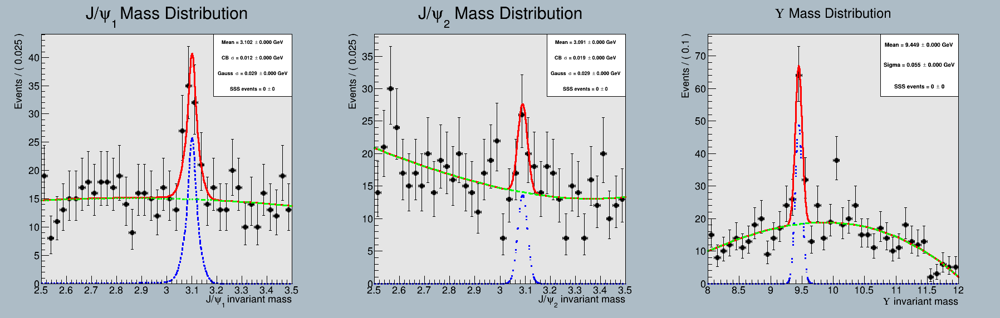
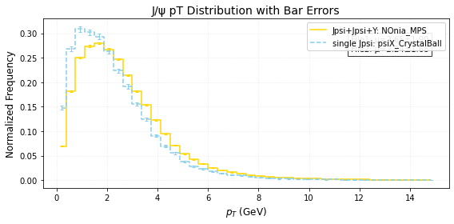
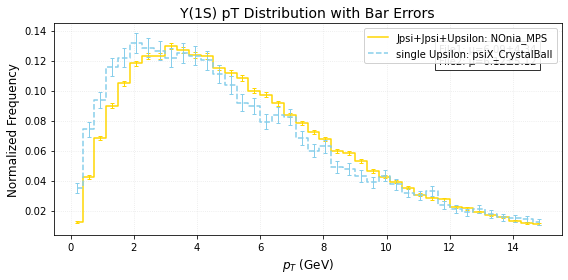
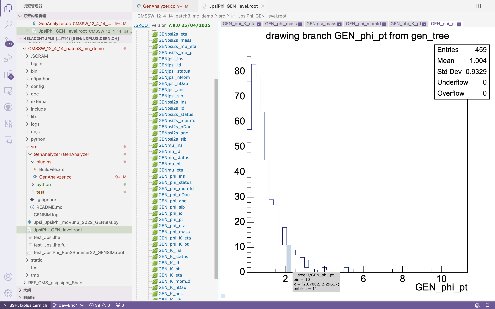
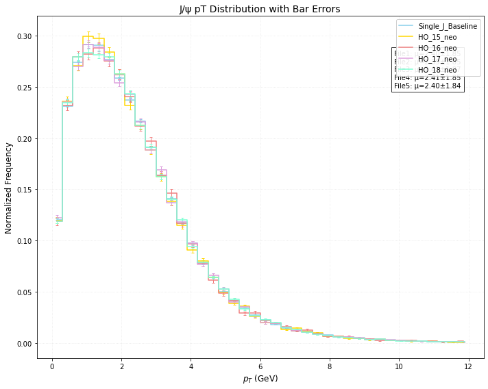
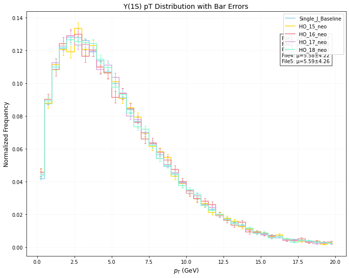

### 8 Apr. 2025

#### $J/\psi+J/\psi+\Upsilon$的更新



设定如下：

* $J/\psi : p_T > 4 \space \mathrm{GeV/c}, |\eta| < 2.5$

    > * 继续优化
    >
* $\Upsilon : p_T > 3 \space \mathrm{GeV/c}, p_{\mu, T} > 4 \space \mathrm{GeV/c}, |\eta| < 2.5$
* PDF for fitting: 
    * Signal: Gaussian
    * Background: 2nd-order polynomial

产额参考数据如下：

```bash
yield_BBB         = 506.232      +/-  27.6162   (limited)
yield_BBS         = 57.7191      +/-  11.6531   (limited)
yield_BSB         = 22.8468      +/-  9.01032   (limited)
yield_BSS         = 3.48014      +/-  3.97018   (limited)
yield_SBB         = 50.7352      +/-  14.4413   (limited)
yield_SBS         = 5.97737      +/-  5.00817   (limited)
yield_SSB         = 0.000206299  +/-  7.75929   (limited)
===== Significance Calculation =====
Log-likelihood (S+B): 2759.3
Log-likelihood (B only): 2759.3
Delta Log-likelihood: 6.65403e-05
Significance: 0.0115361 sigma
```

> My bad...这个好像是用来处理无信号的假设

yield_SSS甚至没有直接给出值...图中写的是$0\pm0$...

以上的信号都是用的是Gaussian而不是CB，而且$\Upsilon(2S, 3S)$的峰还没有加入，但是预期改善不大。作为报告的话...“声明现阶段不宜看这个反应”？产生截面上限值如何估计？

> $\Upsilon(1S)$原本截面就很低，给出的$\sigma_{\mathrm{eff}}$的下限限制应该会很低，继续做这个过程的意义大吗？

又：正在尝试做triple-$J/\psi$的复现，测试工作进行中。

#### 问题：关于Trigger引起的质量分布bias（？）

查阅CMS HLT info得知，`HLT_Dimuon0_Jpsi3p5_Muon2_v`里面的触发条件中，要求存在一对质量在2.95 GeV至3.25 GeV之间的正反muon对；`HLT_DoubleMu4_3_LowMass_v`的不变质量限制则更宽一些，为0.2 GeV 至8.5 GeV。如果选择质量窗为$[2.0, 4.0]$，我们将有机会看到$[2.95,3.25]$区间出现“本底抬高”吗？

> 虽然说之前看到单独使用`HLT_Dimuon0_Jpsi3p5_Muon2_v`的时候旁边的本底也不那么高？

#### 问题：关于使用HELAC-Onia

1. 如何产生含有$\phi(1020)$样本的事例？（联系邵老师？）

2. 产生的TPS样本里面，$J/\psi$和$\Upsilon(1S)$单独的动力学分布已经和单独产生的分布不太一致。如何理解？是不是和选择的部分子分布函数有关系，还是说“存在另外两个粒子”就是一种条件关联？

    

    

    > 稍等，这个discrepancy重要吗？

3. 更换随机种子却得到相同的结果，这是为什么？

    > 这应该完全是软件问题...应该直接问开发者？

> 1,3汇总一个“问题情况说明”。

> LDME直接使用默认值即可。

### 15 May. 2025

#### Goal:

$J/\psi+J/\psi+\Upsilon(1S)$ pLHE to MINIAOD workflow.

#### Dataset Name:

In general, we would adopt the name 

**`QCD-TPS-JPsiJPsiUpsilon1Sto6Mu_TuneCP5_13p6TeV_helaconia2-pythia8`**

> Previously **`JpsiJpsiY1S_TPS_to_6Mu_13p6TeV_HELAC_Onia2_TuneCP5_pythia8`**, changed to meet the suggestions in Ref.[^17] .

We shall start with Run2022C settings and make MC datasets with the following names:

| Data tier   | full name                                                    |
| ----------- | ------------------------------------------------------------ |
| GEN-SIM     | `/QCD-TPS-JPsiJPsiUpsilon1Sto6Mu_TuneCP5_13p6TeV_helaconia2-pythia8/chiw-crab3_Run3Summer22_124X_mcRun3_2022_realistic_v12_MiniAOD_v4_GENSIM-[hash_value]/USER` |
| GEN-SIM-RAW | `/QCD-TPS-JPsiJPsiUpsilon1Sto6Mu_TuneCP5_13p6TeV_helaconia2-pythia8/chiw-crab3_Run3Summer22_124X_mcRun3_2022_realistic_v12_RAW-[hash_value]/USER` |
| AODSIM      | `/QCD-TPS-JPsiJPsiUpsilon1Sto6Mu_TuneCP5_13p6TeV_helaconia2-pythia8/chiw-crab3_Run3Summer22_124X_mcRun3_2022_realistic_v12_AOD-[hash_value]/USER` |
| MINIAODSIM  | `/QCD-TPS-JPsiJPsiUpsilon1Sto6Mu_TuneCP5_13p6TeV_helaconia2-pythia8/chiw-crab3_Run3Summer22_124X_mcRun3_2022_realistic_v12_MiniAOD_v4_MINIAOD-[hash_value]/USER` |

#### CMSSW Config from `cmsDriver.py`

##### pLHE-GEN-SIM

A framework can be built from this command first [^1][^2][^6]:

```bash
# 2022 in CMSSW_12_4_14_patch3
cmsDriver.py \
Configuration/Generator/python/Hadronizer_TuneCP5_13TeV_MLM_5f_max4j_LHE_pythia8_cff.py \
--mc --no_exec \
--python_filename JJY1S_TPS_6Mu_13p6TeV_TuneCP5_pythia8_Run3Summer22_GENSIM.py \
--eventcontent RAWSIM --step GEN,SIM --datatier GEN-SIM \
--conditions 124X_mcRun3_2022_realistic_v12 \
--beamspot Realistic25ns13p6TeVEarly2022Collision \
--era Run3 --geometry DB:Extended -n -1 \
--customise Configuration/DataProcessing/Utils.addMonitoring \
--nThreads 8 --nStreams 8 \
--filein file:JJY_TPS_test.lhe \
--fileout file:JJY1S_TPS_6Mu_13p6TeV_TuneCP5_pythia8_Run3Summer22_GENSIM.root

# 2022 post-EE in CMSSW_12_4_14_patch3
cmsDriver.py \
Configuration/Generator/python/Hadronizer_TuneCP5_13TeV_MLM_5f_max4j_LHE_pythia8_cff.py \
--mc --no_exec \
--python_filename JJY1S_TPS_6Mu_13p6TeV_TuneCP5_pythia8_Run3Summer22EE_GENSIM.py \
--eventcontent RAWSIM --step GEN,SIM --datatier GEN-SIM \
--conditions 124X_mcRun3_2022_realistic_postEE_v1 \
--beamspot Realistic25ns13p6TeVEarly2022Collision \
--era Run3 --geometry DB:Extended -n -1 \
--customise Configuration/DataProcessing/Utils.addMonitoring \
--nThreads 8 --nStreams 8 \
--filein file:JJY_TPS_test.lhe \
--fileout file:JJY1S_TPS_6Mu_13p6TeV_TuneCP5_pythia8_Run3Summer22EE_GENSIM.root

# 2023 in CMSSW_13_0_13
cmsDriver.py \
Configuration/Generator/python/Hadronizer_TuneCP5_13TeV_MLM_5f_max4j_LHE_pythia8_cff.py \
--mc --no_exec \
--python_filename JJY1S_TPS_6Mu_13p6TeV_TuneCP5_pythia8_Run3Summer23_GENSIM.py \
--eventcontent RAWSIM --step GEN,SIM --datatier GEN-SIM \
--conditions auto:phase1_2023_realistic \
--beamspot Realistic25ns13p6TeVEarly2023Collision \
--era Run3 --geometry DB:Extended -n -1 \
--customise Configuration/DataProcessing/Utils.addMonitoring \
--nThreads 8 --nStreams 8 \
--filein file:JJY_TPS_test.lhe \
--fileout file:JJY1S_TPS_6Mu_13p6TeV_TuneCP5_pythia8_Run3Summer23_GENSIM.root

# 2023 post-BPix in CMSSW_13_0_13

# 2024


```

The hadronization fragment shall be modified to be like[^12]:

```python
from Configuration.Generator.Pythia8CommonSettings_cfi import *
from Configuration.Generator.Pythia8aMCatNLOSettings_cfi import *
from Configuration.Generator.PSweightsPythia.PythiaPSweightsSettings_cfi import *
from Configuration.Generator.MCTunesRun3ECM13p6TeV.PythiaCP5Settings_cfi import *

process.generator = cms.EDFilter("Pythia8ConcurrentHadronizerFilter",
    PythiaParameters = cms.PSet(
        pythia8CommonSettingsBlock,       # Common Pythia8 settings  
        pythia8CP5SettingsBlock,          # CMS CP5 tune for Pythia8 
        pythia8aMCatNLOSettingsBlock,     # Settings for aMC@NLO matching  
        pythia8PSweightsSettingsBlock,    # Settings for parton shower (PS) weights  

        processParameters = cms.vstring(
            "TimeShower:nPartonsInBorn = -1",     # Number of partons in Born process (-1 = auto)  
            "TimeShower:mMaxGamma = 4",           # Maximum photon energy in final-state QED shower (GeV)  
            "PDF:pSet = 7",                       # Use PDF set ID 7   
            
            # Decay mode settings
            "23:onMode = 0",                      # Disable all decays of Z boson  
            "23:onIfMatch = 13 -13",              # Allow only Z to mu+mu-
            "443:onMode = 0",                     # Disable all decays of Jpsi 
            "443:onIfMatch = 13 -13",             # Allow only Jpsi to mu+mu- decay
            "20443:onMode = 0",                   # Disable all decays of Chi_c1  
            "20443:onIfAny = 443",                # Allow Chi_c1 to Jpsi decay  
            "445:onMode = 0",                     # Disable all decays of Chi_c2  
            "445:onIfAny = 443",                  # Allow Chi_c2 to Jpsi decay  
            "10441:onMode=0",                     # Disablealldecaysofh_c
            "10441:onIfAny = 443",                # Allow h_c to Jpsi decay  
            "100443:onMode = 0",                  # Disable all decays of psi(2S)  
            "100443:onIfAny = 443",               # Allow psi(2S) to Jpsi decay 
            "553:onMode = 0",                     # Disable all decays of Upsilon(1S)
            "553:onIfMatch = 13 -13",             # Allow Upsilon(1S) to mu+mu- decay
            "100553:onMode = 0",                  # Disable all decays of Upsilon(2S)
            "100553:onIfMatch = 13 -13",          # Allow Upsilon(2S) to mu+mu- decay
            "200553:onMode = 0",                  # Disable all decays of Upsilon(3S)
            "200553:onIfMatch = 13 -13",          # Allow Upsilon(3S) to mu+mu- decay
        ),

        parameterSets = cms.vstring(
            "pythia8CommonSettings",      
            "pythia8CP5Settings",         
            "pythia8aMCatNLOSettings",    
            "processParameters",          
            "pythia8PSweightsSettings"    
        )
    ),
    comEnergy = cms.double(13600),                    # Collision energy, needs to be same as the setting in HELAC-Onia.
    maxEventsToPrint = cms.untracked.int32(0),        # Do not print event details  
    pythiaHepMCVerbosity = cms.untracked.bool(False), # Disable HepMC event output verbosity  
    pythiaPylistVerbosity = cms.untracked.int32(0),   # Disable Pythia event listing output  
    filterEfficiency = cms.untracked.double(1.0),     # Set filter efficiency to 1.0 (all events pass)  
)
```

##### DIGI, L1T, HLT[^1][^2][^4][^6]

```bash
# 2022, CMSSW_12_4_14_patch3
cmsDriver.py \
--python_filename JJY1S_TPS_6Mu_13p6TeV_TuneCP5_pythia8_Run3Summer22_RAW.py \
--eventcontent PREMIXRAW --step DIGI,DATAMIX,L1,DIGI2RAW,HLT:2022v12 \
--procModifiers premix_stage2,siPixelQualityRawToDigi --datamix PreMix \
--datatier GEN-SIM-RAW \
--conditions 124X_mcRun3_2022_realistic_v12 \
--beamspot Realistic25ns13p6TeVEarly2022Collision \
--era Run3 --geometry DB:Extended -n -1 \
--customise Configuration/DataProcessing/Utils.addMonitoring \
--nThreads 1 --nStreams 1 \
--pileup_input filelist:/cvmfs/cms.cern.ch/offcomp-prod/premixPUlist/PREMIX-Run3Summer22DRPremix.txt \
--mc --no_exec \
--filein file:JJY1S_TPS_6Mu_13p6TeV_TuneCP5_pythia8_Run3Summer22_GENSIM.root \
--fileout file:JJY1S_TPS_6Mu_13p6TeV_TuneCP5_pythia8_Run3Summer22_RAW.root


# 2022 post-EE, CMSSW_12_4_14_patch3
cmsDriver.py \
--python_filename JJY1S_TPS_6Mu_13p6TeV_TuneCP5_pythia8_Run3Summer22EE_RAW.py \
--eventcontent PREMIXRAW --step DIGI,DATAMIX,L1,DIGI2RAW,HLT:2022v14 \
--procModifiers premix_stage2,siPixelQualityRawToDigi --datamix PreMix \
--datatier GEN-SIM-RAW \
--conditions 124X_mcRun3_2022_realistic_postEE_v1 \
--beamspot  Realistic25ns13p6TeVEarly2022Collision \
--era Run3 --geometry DB:Extended -n -1 \
--customise Configuration/DataProcessing/Utils.addMonitoring \
--nThreads 1 --nStreams 1 \
--pileup_input filelist:/cvmfs/cms.cern.ch/offcomp-prod/premixPUlist/PREMIX-Run3Summer22EEDRPremix.txt \
--mc --no_exec \
--filein file:JJY1S_TPS_6Mu_13p6TeV_TuneCP5_pythia8_Run3Summer22EE_GENSIM.root \
--fileout file:JJY1S_TPS_6Mu_13p6TeV_TuneCP5_pythia8_Run3Summer22EE_RAW.root

```

> Very careful with the CMSSW release here! Later releases have removed the `HLT:2022v12` settings at `cmsDriver.py`-level.

Here we are using the pileup files obtained via `cvmfs`. A more flexible way to do it is using this script to obtain the pileup files available sites:

```bash
wget https://raw.githubusercontent.com/FNALLPC/lpc-scripts/refs/heads/master/get_files_on_disk.py
python3 get_files_on_disk.py -a T2_CH_CERN T1_US_FNAL_Disk -o PREMIX.txt DATASET_NAME

```

The favored datasets are

| Era                    | Dataset                                                      |
| ---------------------- | ------------------------------------------------------------ |
| Run2022                | `/Neutrino_E-10_gun/Run3Summer21PrePremix-Summer22_124X_mcRun3_2022_realistic_v11-v2/PREMIX` |
| Run2023C               | `/Neutrino_E-10_gun/Run3Summer21PrePremix-Summer23_130X_mcRun3_2023_realistic_v13-v1/PREMIX` |
| Run2023D ("post-BPix") | `/Neutrino_E-10_gun/Run3Summer21PrePremix-Summer23BPix_130X_mcRun3_2023_realistic_postBPix_v1-v1/PREMIX` |
| Run2024                | `/Neutrino_E-10_gun/RunIIISummer24PrePremix-Premixlib2024_140X_mcRun3_2024_realistic_v26-v1/PREMIX` |
| Run2025 (?)            | (No PREMIX dataset so far.)                                  |

> The datasets above are actually inferred from the lists in `cvmfs`.


##### RECO[^1][^2][^6][^12]

```bash
# 2022
cmsDriver.py \
--python_filename JJY1S_TPS_6Mu_13p6TeV_TuneCP5_pythia8_Run3Summer22_RECO.py \
--eventcontent AODSIM --step RAW2DIGI,L1Reco,RECO,RECOSIM \
--procModifiers siPixelQualityRawToDigi --datatier GEN-SIM-RAW \
--conditions 124X_mcRun3_2022_realistic_v12 \
--beamspot Realistic25ns13p6TeVEarly2022Collision \
--era Run3 --geometry DB:Extended -n -1 \
--customise Configuration/DataProcessing/Utils.addMonitoring \
--nThreads 1 --nStreams 1 \
--mc --no_exec \
--filein file:JJY1S_TPS_6Mu_13p6TeV_TuneCP5_pythia8_Run3Summer22_RAW.root \
--fileout file:JJY1S_TPS_6Mu_13p6TeV_TuneCP5_pythia8_Run3Summer22_AOD.root

# 2022 post-EE
cmsDriver.py \
--python_filename JJY1S_TPS_6Mu_13p6TeV_TuneCP5_pythia8_Run3Summer22EE_RECO.py \
--eventcontent AODSIM --step RAW2DIGI,L1Reco,RECO,RECOSIM \
--procModifiers siPixelQualityRawToDigi --datatier GEN-SIM-RAW \
--conditions 124X_mcRun3_2022_realistic_postEE_v1 \
--beamspot Realistic25ns13p6TeVEarly2022Collision \
--era Run3 --geometry DB:Extended -n -1 \
--customise Configuration/DataProcessing/Utils.addMonitoring \
--nThreads 1 --nStreams 1 \
--mc --no_exec \
--filein file:JJY1S_TPS_6Mu_13p6TeV_TuneCP5_pythia8_Run3Summer22EE_RAW.root \
--fileout file:JJY1S_TPS_6Mu_13p6TeV_TuneCP5_pythia8_Run3Summer22EE_AOD.root
```

##### MINIAOD[^1][^2][^4][^6][^12]

```bash
# 2022, CMSSW_13_0_13
cmsDriver.py \
--python_filename JJY1S_TPS_6Mu_13p6TeV_TuneCP5_pythia8_Run3Summer22_SKIM.py \
--eventcontent MINIAODSIM --step PAT \
--datatier MINIAODSIM \
--conditions 124X_mcRun3_2022_realistic_v12 \
--era Run3 --geometry DB:Extended -n -1 \
--customise Configuration/DataProcessing/Utils.addMonitoring \
--nThreads 1 --nStreams 1 \
--mc --no_exec \
--filein file:JJY1S_TPS_6Mu_13p6TeV_TuneCP5_pythia8_Run3Summer22_AOD.root \
--fileout file:JJY1S_TPS_6Mu_13p6TeV_TuneCP5_pythia8_Run3Summer22_MiniAOD.root

# 2022 post-EE, CMSSW_13_0_13
cmsDriver.py \
--python_filename JJY1S_TPS_6Mu_13p6TeV_TuneCP5_pythia8_Run3Summer22_RECO.py \
--eventcontent MINIAODSIM --step PAT \
--datatier MINIAODSIM \
--conditions 124X_mcRun3_2022_realistic_v12 \
--era Run3 --geometry DB:Extended -n -1 \
--customise Configuration/DataProcessing/Utils.addMonitoring \
--nThreads 1 --nStreams 1 \
--mc --no_exec \
--filein file:JJY1S_TPS_6Mu_13p6TeV_TuneCP5_pythia8_Run3Summer22_AOD.root \
--fileout file:JJY1S_TPS_6Mu_13p6TeV_TuneCP5_pythia8_Run3Summer22_MiniAOD.root
```


#### `CRAB` Config for Running Generation Steps Above

On `CRAB`, running CMSSW config with pLHE input could mean a bit more trouble, especially when we have A LOT of pLHE to process and we are adding PU into consideration.

The first issue is that pLHE could become too large to be transferred to the `CRAB` input sandbox for later processing. In our case, it is \~ 900k events split into \~ 9k files with a total size of \~ 1.8GB, far exceeding the 100MB limit of `CRAB`[^9]. This demands that we do not include pLHE files as inputs in CRAB config, but rather, handle the pLHE file at where they are directly accessible.

For the `GEN-SIM ` step, we are setting the input file source with the PFN to our CERNBox, adding all files into the list of files to be processed, and leaving the job splitting to CRAB. The produced data files will be mostly kept at `T2_CN_Beijing` .

> Very careful here! There have been reports on faulty handling of LHE event ranges.[^15] This was only recently fixed and a section in crab config seems to be required for the thing to work:
> ```python
> config.section_("General")
> config.General.instance = 'preprod'
> ```
>
> Yet from recent tests, we actually found that this declaration was not needed. See this testing dataset at `DAS` query:
>
> ```bash
> file dataset=/JpsiJpsiY1S_TPS_to_6Mu_13p6TeV_HELAC_Onia2_TuneCP5_pythia8/chiw-crab3_JJY1S_TPS_6Mu_13p6TeV_TuneCP5_pythia8_Run3Summer22_GENSIM-b97cb38d4172304bce7c88d7a279c79c/USER
> ```
>
> The size of the files do differ, indicating that the splitting was indeed done strictly.
>
> Short summary: just go ahead with the LHE files!

For the `GEN-SIM ` and `DIGI-L1T-HLT` steps, we prefer conducting them only at `T2_CH_CERN`. For the former one, since the LHE files are at `T3_CH_CERNBOX`, running the tasks at `T2_CH_CERN` seems the safest way to do it. For the latter one, it is because `T2_CH_CERN` has an abundant supply of `PREMIX` files and we would like to avoid frequently transferring the pileup samples.[^9]


### 18 May. 2025

Unluckily, I ran into some trouble when I was testing the `CRAB` config. Some excess data was produced and I have to invalidate them via `crab setfilestatus` .

### 19 May. 2025

Looks like all those intermidiary files can only be manually removed.

Previously, we have generated `/JpsiJpsiY1S_TPS_to_6Mu_13p6TeV_HELAC_Onia2_TuneCP5_pythia8/chiw-crab3_JJY1S_TPS_6Mu_13p6TeV_TuneCP5_pythia8_Run3Summer22_GENSIM-b97cb38d4172304bce7c88d7a279c79c/USER`, which was only a short test. To remove it, well...

```bash
crab setfilestatus --dataset=/JpsiJpsiY1S_TPS_to_6Mu_13p6TeV_HELAC_Onia2_TuneCP5_pythia8/chiw-crab3_JJY1S_TPS_6Mu_13p6TeV_TuneCP5_pythia8_Run3Summer22_GENSIM-b97cb38d4172304bce7c88d7a279c79c/USER --status=INVALID
crab setdatasetstatus --dataset=/JpsiJpsiY1S_TPS_to_6Mu_13p6TeV_HELAC_Onia2_TuneCP5_pythia8/chiw-crab3_JJY1S_TPS_6Mu_13p6TeV_TuneCP5_pythia8_Run3Summer22_GENSIM-b97cb38d4172304bce7c88d7a279c79c/USER --status=INVALID
```

The first command sets all those files as invalid. The second one sets the dataset itself as invalid. What remains to be done is removing all existing files via `xrdfs` .

The first thing to do will be retrieving the LFN of all dataset files. 

```bash
dasgoclient --query="file status=INVALID dataset=/JpsiJpsiY1S_TPS_to_6Mu_13p6TeV_HELAC_Onia2_TuneCP5_pythia8/chiw-crab3_JJY1S_TPS_6Mu_13p6TeV_TuneCP5_pythia8_Run3Summer22_GENSIM-b97cb38d4172304bce7c88d7a279c79c/USER instance=prod/phys03" > tmp_GS_to_rm.txt
```

> Took me a while to figure out the right command to use! The `instance=prod/phys03` parameter is taken from Ref. [^19]. Apparently I was not the first one to be puzzled with this... The `status=INVALID` command is there to avoid mistakenly removing some other data files.

Check the `tmp_GS_to_rm` with your favourite editor or just `less`, and then proceed to remove with `xrdfs` command:

```bash
cat tmp_GS_to_rm.txt | xargs -I {} xrdfs xrootd-cms.infn.it rm "{}"
```

> The "`xrootd-cms.infn.it`" specification is picked since I am working at Beijing. The workbook[^20] suggests using `cmsxrootd.fnal.gov` for accessing from the US and `cms-xrd-global.cern.ch` as the "global redirector".

### 20 May. 2025

A lovely little script generated with the help of DeepSeek:

```bash
cat /cvmfs/cms.cern.ch/offcomp-prod/premixPUlist/PREMIX-Run3Summer22DRPremix.txt \
| sed -r -e "s,^(.*)(/store.*)$,\2,g" \
| xargs -I {} bash -c '
    file={};
    sites=$(dasgoclient --query "site file=$file" 2>/dev/null);
    if [[ "$sites" =~ "T2_CH_CERN" ]]; then
        echo "$file"
    fi
'
```

Nah, perhaps just ignore it. I shall be fine with the default list.

### 21 May. 2025

Before long I ran into the trouble of having too much files on `T2_CN_Beijing`.

This may look stupid, yet I just have to begin removing the used intermediary files even before all jobs in the next stage are finished. To make sure this can be done more neatly, it would be absolutely necessary to split the jobs with `"FileBased"` option and to set `config.JobType.unitsPerJob = 1` .

Fine. We'll do it all over.

It might be some good way to set up some kind of "watcher" that runs on backstage, fetch the list of finished jobs regularly and remove the corresponding intermidiary files.

> Risk of automation? Apparently, if some step went wrong, we will just have to do it all over again...Perhaps make it less automated then...

### 29 May. 2025

We are trying directly pasting the pythia config section from Huasheng Shao.

```python
from Configuration.Generator.Pythia8CommonSettings_cfi import *
from Configuration.Generator.Pythia8aMCatNLOSettings_cfi import *
from Configuration.Generator.PSweightsPythia.PythiaPSweightsSettings_cfi import *
from Configuration.Generator.MCTunesRun3ECM13p6TeV.PythiaCP5Settings_cfi import *

process.generator = cms.EDFilter("Pythia8ConcurrentHadronizerFilter",
    PythiaParameters = cms.PSet(
        pythia8CommonSettingsBlock,       # Common Pythia8 settings  
        pythia8CP5SettingsBlock,          # CMS CP5 tune for Pythia8 
        pythia8aMCatNLOSettingsBlock,     # Settings for aMC@NLO matching  
        pythia8PSweightsSettingsBlock,    # Settings for parton shower (PS) weights  

        processParameters = cms.vstring(
            "TimeShower:nPartonsInBorn = -1",     # Number of partons in Born process (-1 = auto)  
            "TimeShower:mMaxGamma = 4",           # Maximum photon energy in final-state QED shower (GeV)  
            "PDF:pSet = LHAPDF6:CT14nlo"        , # PDF set used in showers and multiparton interactions
            "ProcessLevel:all = on"             , # Generation
            "ProcessLevel:resonanceDecays = on" , # Resonance decays
            "PartonLevel:all = on"              , # Parton level: if off, stops after hard process generation
            "PartonLevel:ISR = on"              , # Initial state shower
            "PartonLevel:FSR = on"              , # Final state shower
            "PartonLevel:FSRinProcess = on"     , # Final state shower in association with the hard process
            "PartonLevel:FSRinResonances = on"  , # Final state shower in resonance decays
            "HadronLevel:all = on"              , # Hadron level: if off, stops before hadronization
            "HadronLevel:Hadronize = on"        , # Hadronization
            "#HadronLevel:Decay = on"           , # Hadron decays
            "PhaseSpace:mHatMin = 4."           , # Min invariant mass
            "PhaseSpace:mHatMax = -1."          , # Max invariant mass
            "PhaseSpace:pTHatMin = 0."          , # Min pT in 2->2
            "PhaseSpace:pTHatMax = -1."         , # Max pT in 2->2
            "PhaseSpace:pTHatMinDiverge = 1."   , # If massless final state, to avoid divergences
            "PhaseSpace:useBreitWigners = on"   , # Masses according to Breit-Wigner
            "#PhaseSpace:pTHat3Min = 0."        , # Min pT for the hardest parton in 2->3
            "PhaseSpace:pTHat3Max = -1."        , # Max pT for the hardest parton in 2->3
            "PhaseSpace:pTHat5Min = 0."         , # Min pT for the softest parton in 2->3
            "PhaseSpace:pTHat5Max = -1."        , # Max pT for the softest parton in 2->3
            "PhaseSpace:RsepMin = 0."           , # Min R separation in 2->3  

            # FSR settings
			"TimeShower:pTmaxMatch = 1", # Use scalup (re-check)
            "TimeShower:pTmaxFudge = 1.", # Factor changing the max scale
            "TimeShower:alphaSvalue = 0.118", # Alpha_s(MZ) in final-state shower
            "TimeShower:alphaSorder = 1", # Alpha_s running order in final-state shower
            "TimeShower:alphaEMorder = 0", # Alpha_EM running order in final-state shower
            "TimeShower:interleave = on", # If on, FSR interleaved with ISR
            "TimeShower:allowBeamRecoil = on", # If off, no energy transfer from ISR to FSR
            "TimeShower:dampenBeamRecoil = off", # Dampens the effect of beam recoil
            "TimeShower:globalRecoil = on", # All final-state particles recoil against the branching
            "TimeShower:nMaxGlobalRecoil = 1", # Number of splittings with TimeShower:globalRecoil = on
            "TimeShower:globalRecoilMode = 2", # Global recoil only for S events whose first emission is FSR
            "TimeShower:nMaxGlobalBranch = 1", # Number of FSR splittings proposed with global recoil
            "TimeShower:nPartonsInBorn = -1", # Number of Born QCD final-state partons (to treat H and S differently)
            "TimeShower:limitPTmaxGlobal = on", # Limits pT < min(SCALUP,mDipole/2)
            "TimeShower:QCDshower = on", # QCD final-state shower
            "TimeShower:nGluonToQuark = 5", # Number if flavors allowed in g->qqbar
            "TimeShower:QEDshowerByQ = off", # Prevent quarks from radiating photons
            "TimeShower:QEDshowerByL = off", # Prevent leptons from radiating photons
            "TimeShower:QEDshowerByGamma = off", # Prevent photons from branching
            "TimeShower:MEcorrections = off", # No Matrix-element corrections
            "TimeShower:MEafterFirst = off", # No Matrix-element corrections after first emission
            "TimeShower:phiPolAsym = on", # Azimuthal asymmetry induced by gluon polarization
            "TimeShower:alphaSuseCMW = false", # Use the CMW prescription in FSR
            
            # ISR settings
			"SpaceShower:pTmaxMatch = 1      ", # Use scalup (re-check)
            "SpaceShower:pTmaxFudge = 1.     ", # Factor changing the max scale
            "SpaceShower:alphaSvalue = 0.118 ", # Alpha_s(MZ) in initial-state shower
            "SpaceShower:alphaSorder = 1     ", # Alpha_s running order in initial-state shower
            "SpaceShower:alphaEMorder = 0    ", # Alpha_EM running order in initial-state shower
            "SpaceShower:QCDshower = on      ", # QCD initial-state shower
            "SpaceShower:QEDshowerByQ = off  ", # Prevent quarks from radiating photons
            "SpaceShower:QEDshowerByL = off  ", # Prevent leptons from radiating photons
            "SpaceShower:MEcorrections = off ", # No Matrix-element corrections
            "SpaceShower:MEafterFirst = off  ", # No Matrix-element corrections after first emiision
            "SpaceShower:phiPolAsym = on     ", # Azimuthal asymmetry induced by gluon polarization
            "SpaceShower:nQuarkIn = 5        ", # Number of flavors in g->qqbar and also in incoming beams
            "SpaceShower:rapidityorder = off ", # Do not order branchings in rapidity
            "SpaceShower:alphaSuseCMW = false", # Use the CMW prescription in ISR

            # Non-perturbative settings
			"BeamRemnants:primordialKT = on",
            # Decay mode settings
            "23:onMode = 0",                      # Disable all decays of Z boson  
            "23:onIfMatch = 13 -13",              # Allow only Z to mu+mu-
            "443:onMode = 0",                     # Disable all decays of Jpsi 
            "443:onIfMatch = 13 -13",             # Allow only Jpsi to mu+mu- decay
            "20443:onMode = 0",                   # Disable all decays of Chi_c1  
            "20443:onIfAny = 443",                # Allow Chi_c1 to Jpsi decay  
            "445:onMode = 0",                     # Disable all decays of Chi_c2  
            "445:onIfAny = 443",                  # Allow Chi_c2 to Jpsi decay  
            "10441:onMode=0",                     # Disablealldecaysofh_c
            "10441:onIfAny = 443",                # Allow h_c to Jpsi decay  
            "100443:onMode = 0",                  # Disable all decays of psi(2S)  
            "100443:onIfAny = 443",               # Allow psi(2S) to Jpsi decay 
            "553:onMode = 0",                     # Disable all decays of Upsilon(1S)
            "553:onIfMatch = 13 -13",             # Allow Upsilon(1S) to mu+mu- decay
            "100553:onMode = 0",                  # Disable all decays of Upsilon(2S)
            "100553:onIfMatch = 13 -13",          # Allow Upsilon(2S) to mu+mu- decay
            "200553:onMode = 0",                  # Disable all decays of Upsilon(3S)
            "200553:onIfMatch = 13 -13",          # Allow Upsilon(3S) to mu+mu- decay
			"111:mayDecay = false",               # stable pi0
            "#211:mayDecay = false",              # stable pions
            "130:mayDecay = false",               # stable K_L0
            "310:mayDecay = false",               # stable K_S0
            "311:mayDecay = false",               # stable K0
            "321:mayDecay = false",               # stable K+-
            "-13:maydecay = false",               # stable mu+
            "13:maydecay = false",                # stable mu-
			"333:onMode = 0",
			"333:onIfMatch = 321 -321"
        ),

        parameterSets = cms.vstring(
            "pythia8CommonSettings",      
            "pythia8CP5Settings",         
            "pythia8aMCatNLOSettings",    
            "processParameters",          
            "pythia8PSweightsSettings"    
        )
    ),
    comEnergy = cms.double(13600),                    # Collision energy, needs to be same as the setting in HELAC-Onia.
    maxEventsToPrint = cms.untracked.int32(5),        # Do not print event details  
    pythiaHepMCVerbosity = cms.untracked.bool(True), # Disable HepMC event output verbosity  
    pythiaPylistVerbosity = cms.untracked.int32(0),   # Disable Pythia event listing output  
    filterEfficiency = cms.untracked.double(1.0),     # Set filter efficiency to 1.0 (all events pass)  
)
```

Using 1000 $J/\psi$ samples as input, we are seeing ~50% $J/\psi+\phi$ in the end, with ~5% $p_\phi^T > 2~\mathrm{GeV/c}$ . I don't consider this efficiency satisfactory.

> Try raising `pT hat` a little. 2GeV/c may be good. 



#### A bit of good news: crab jobs were going good.

Now able to proceed onto `RECO` stage (`AOD` production).

TODO: develop an "auto-acquire script" to obtain the list of processed last-stage files.


### 30 Jun. 2025

Regarding the HELAC-Onia 2.7.6 issue documented on 8th of April, Dr. Shao had located a missing "initialization" for the random number generator. 

> #### Fix for `pp_NOnia_MPS` Addon Random seed
>
> 1. `cd` into your `HELAC-Onia-2.7.6` directory
>
> 2. Copy  `src/RANDA_init.inc` into `addon/pp_NOnia_MPS/src`:
>
>     ```bash
>     cp src/RANDA_init.inc addon/pp_NOnia_MPS/src
>     ```
>
> 3. Open file `addon/pp_NOnia_MPS/src/pp_NOnia_MPS.f90 `
>
> 4. Locate line <u>**34**</u>, add this code right after this line:
>
>     ```fortran
>     INCLUDE "RANDA_init.inc"
>     ```
>
> 
>
> 5. After this, remove the compiled binary executables for `pp_NOnia_MPS` : 
>
>     ```bash
>     rm -f bin/HO_pp_NOnia_MPS
>     rm -f addon/pp_NOnia_MPS/bin/HO_pp_NOnia_MPS
>     ```
>
> When next time using `./ho_cluster`, upon initialization, the `pp_NOnia_MPS` package will be recompiled and the random seed should work.

After this fix, no more discrepancy was found between $p_T$ distributions of single $J/\psi$ and $\Upsilon$ and those from probed TPS events.





### References:

[^1]:  `cmsDriver.py` hands-on guide from the 17th (?) CMS Induction Event (Feb. 2025, @ CERN), by Phat Srimanobhas (for `cmsDriver.py` general config and `PreMix` configuration.): https://phat-srimanobhas.gitbook.io/cmsinductionwinter2025-cmssw/cmssw-101/cmsdriver

[^2]: PdmV suggestions (esp. `cmsDriver.py` command reference for MC in `Run3Summer2022`, `Run3Summer2022EE`, `Run3Summer23`, `Run3Summer23BPix`) : https://twiki.cern.ch/twiki/bin/viewauth/CMS/PdmVRun3Analysis

[^3]: A more comprehensive guide: https://twiki.cern.ch/twiki/bin/view/CMSPublic/SWGuideSimulation

[^4]: On event mixing for PU simulation: https://twiki.cern.ch/twiki/bin/view/CMSPublic/SWGuideMixingModule

[^5]: Vertex smearing configurations (for `--beamspot` configurations)(only intended as a list of "what is available", please refer to PdmV suggestions): https://cmssdt.cern.ch/lxr/source/Configuration/StandardSequences/python/VtxSmeared.py 

[^6]: Full chain MC hands-on guide from the 2nd China CMS Winter School (Jan. 2024, @ SYSU), by Zhen Hu and Tongguang Cheng: https://indico.ihep.ac.cn/event/21064/contributions/148451/attachments/75611/93299/FullMC_HandsOn.pdf

[^7]: LXR reference for all sorts of existing `Pythia8ConcurrentHadronizerFilter` fragments: https://cmssdt.cern.ch/lxr/source/Configuration/Generator/python/

[^8]: General crab job reference: https://twiki.cern.ch/twiki/bin/view/CMSPublic/SWGuideCrab

[^9]: To run crab jobs with LHE input: https://twiki.cern.ch/twiki/bin/view/CMSPublic/CRAB3AdvancedTopic#Running_MC_generation_on_LHE_fil 

[^10]: Another tutorial on running crab jobs with LHE input: https://twiki.cern.ch/twiki/bin/view/CMSPublic/CRAB3AdvancedTutorial#Exercise_5_LHE)

[^11]: PdmV suggestions on MC tuning and PDFs: https://cms-pdmv.gitbook.io/project/mccontact/info-for-mc-production-for-run3-campaigns
[^12]: HELAC-Onia 2.7.6 production and further simulation tutorial, from private communication with Yiyang Zhao.
[^13]: A CMS Talk post which might be useful for configuring "sequential MC production". https://cms-talk.web.cern.ch/t/crab-not-accepting-input-dataset-from-fnal-lpc-storage-site/18135
[^14]: Notes on using `root://` PFN paths in CMSSW config for input files. https://twiki.cern.ch/twiki/bin/view/CMSPublic/WorkBookXrootdService
[^15]: Notes on splitting pLHE inputs with CRAB jobs: https://cms-talk.web.cern.ch/t/every-crab-job-runs-with-the-same-input-event/2489/9
[^16]: A test run to check the crab config file.  https://cmsweb.cern.ch/crabserver/ui/task/250518_073925%3Achiw_crab_crab3_JJY1S_TPS_6Mu_13p6TeV_TuneCP5_pythia8_Run3Summer22_GENSIM-pre02
[^17]: Naming convention for MC datasets. https://cms-pdmv.gitbook.io/project/mccontact/rules-for-dataset-names
[^ 18]: Invalidating unwanted yet published files: https://twiki.cern.ch/twiki/bin/view/CMSPublic/Crab3DataHandling#Changing_a_dataset_or_file_statu
[^19]: On retrieving private MC file list via DAS CLI: https://cms-talk.web.cern.ch/t/problems-to-query-files-of-a-dataset-with-dasgoclient/38302
[^20]: On choosing the redirector of `xrootd` service: https://twiki.cern.ch/twiki/bin/view/CMSPublic/WorkBookXrootdService#ReDirector


