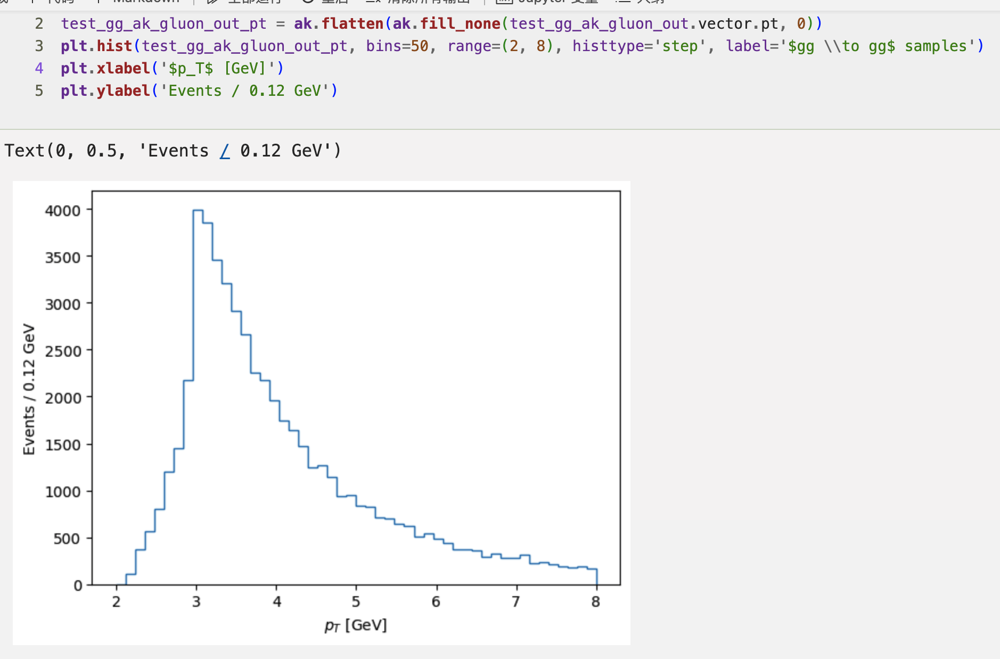
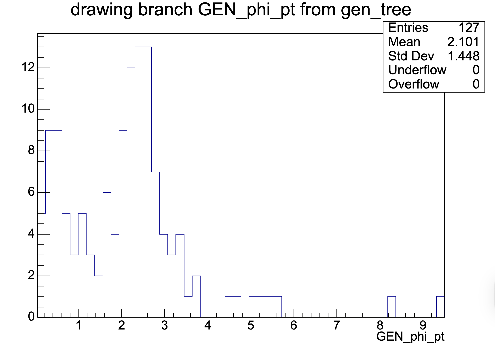
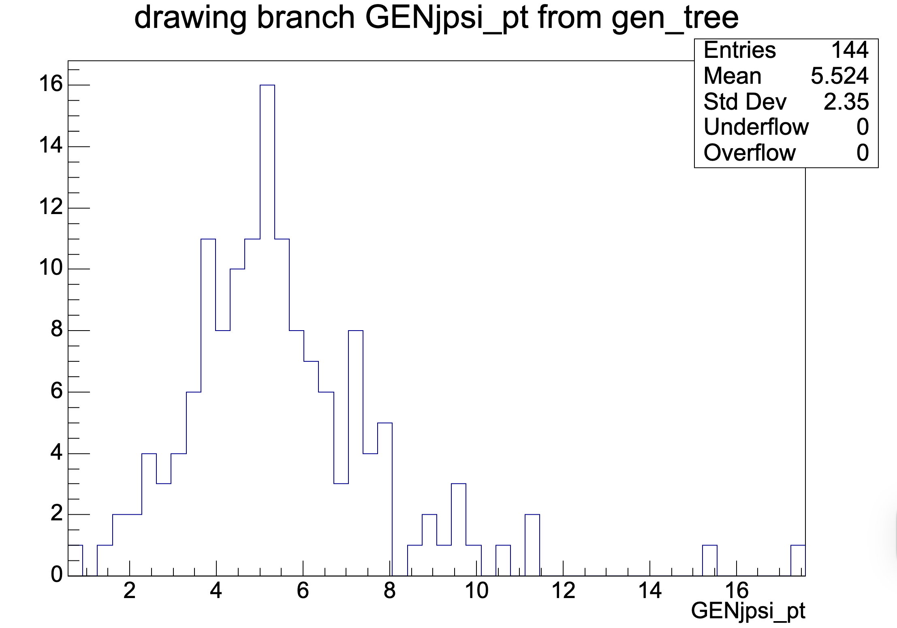

# DPS $(J/\psi+J/\psi)+\phi(1020)$ Sample Production

## 18 Sept. 2025

> **Pay tribute to the victims of the War of Resistance Against Japanese Aggression and the World Anti-Fascist War.**
>
> See also: the September 18th Incident. (1931.9.18)

### Method

1. SPS $J/\psi+J/\psi$ samples from `HELAC-Onia 2.0` addon `pp_psiY_SPS` , setting `minconiapt = 4.0p0`

2. `generate g g > g g` with `HELAC-Onia 2.0`

3. Mix to obtain "$J/\psi+J/\psi+gg$" event LHE

4. Hadronize using the CMSSW Pythia8 interface, applying the following filter configuration:
    ```python
    
    process.genJpsiFilter = cms.EDFilter("MCSingleParticleFilter",
        MinPt  = cms.untracked.vdouble(4.0),
    	MinEta = cms.untracked.vdouble(-3.0),
        MaxEta = cms.untracked.vdouble(3.0),
        ParticleID = cms.untracked.vint32(443),
    )
    
    process.genPhiFilter = cms.EDFilter("MCSingleParticleFilter",
        MinPt  = cms.untracked.vdouble(2.0),
        MinEta = cms.untracked.vdouble(-3.0),
        MaxEta = cms.untracked.vdouble(3.0),
        ParticleID = cms.untracked.vint32(333),
    )
    
    process.ProductionFilterSequence = cms.Sequence(process.generator*process.genJpsiFilter*process.genPhiFilter
    ```

### Outcome

LHE level: 28765 events

GEN level: terminated at 2565 events (unknown error)

GEN-Ntuple level: 72 events







Apparently, we should change to "$J/\psi$-pair" filter...but improvement might not be significant.

### Error Report:

```
----- Begin Fatal Exception 18-Sep-2025 05:49:52 CEST-----------------------
An exception of category 'StdException' occurred while
   [0] Processing  Event run: 1 lumi: 1 event: 891 stream: 0
   [1] Running path 'generation_step'
   [2] Calling method for module Pythia8ConcurrentHadronizerFilter/'generator'
Exception Message:
A std::exception was thrown.
vector::_M_range_check: __n (which is 1072768132) >= this->size() (which is 21)
----- End Fatal Exception -------------------------------------------------
```

Similar error seen in previous TPS sample productions without the "gluon squashing" method. But we have only two pairs of incoming gluons.

Re-run the config, and the error was seen again at 892 events.

Could be some parton-shower-level issue. Need a fix. ("gluon squashing" again?)


### 18 Nov. 2025 

#### Linking `HELAC-Onia 2.0` to `Pythia 8` to Shower Events with Color-Octet Contributions

#### Connecting Showered `HepMC`-Format  `.dat` with CMSSW

At this stage, `GEN` is already fully handled, the issue is how to feed it into SIM.

To start with, we produce a standard config:

```bash
cmsDriver.py --mc --no_exec \
--python_filename SIM_13p6TeV_TuneCP5_pythia8_Run3Summer22_fromHepMC.py \
--eventcontent RAWSIM --step GEN,SIM --datatier GEN-SIM \
--conditions 124X_mcRun3_2022_realistic_v12 \
--beamspot Realistic25ns13p6TeVEarly2022Collision \
--era Run3 --geometry DB:Extended -n -1 \
--customise Configuration/DataProcessing/Utils.addMonitoring \
--nThreads 8 --nStreams 8 \
--filein file:test_Jpsi1Jpsi1Y8.dat \
--fileout file:step1_HepMC_GENSIM.root
```

Two modifications would be necessary.

##### Source File Configuration as `MCFileSource`

Substitute:

```python
process.source = cms.Source("PoolSource",
    dropDescendantsOfDroppedBranches = cms.untracked.bool(False),
    fileNames = cms.untracked.vstring('file:test_Jpsi1Jpsi1Y8.dat'),
    inputCommands = cms.untracked.vstring(
        'keep *',
        'drop LHEXMLStringProduct_*_*_*'
    ),
    secondaryFileNames = cms.untracked.vstring()
)
```

with:

```python
# Input source
process.source = cms.Source("MCFileSource",
    fileNames = cms.untracked.vstring('file:test_Jpsi1Jpsi1Y8.dat'),
    firstLuminosityBlockForEachRun = cms.untracked.VLuminosityBlockID([]),
)

```

##### Customization to Ensure Including `VtxSmeared` as Product:

```python
# Importing the necesssary modules.
from IOMC.EventVertexGenerators.VtxSmearedParameters_cfi import Realistic25ns13p6TeVEarly2022CollisionVtxSmearingParameters, VtxSmearedCommon

# Defining the set of modules to customize
def addVertexSmeared(process, seed=1243987, engine='TRandom3'):
    # Generator interface
    process.genParticles.src = cms.InputTag("source","generator")
    VtxSmearedCommon.src = cms.InputTag("source","generator")
    RandCommonParam = cms.PSet(
        initialSeed = cms.untracked.uint32(seed),
        engineName = cms.untracked.string(engine),
    )
    process.RandomNumberGeneratorService.VtxSmeared = RandCommonParam
    process.RandomNumberGeneratorService.generatorSmeared = RandCommonParam
    process.VtxSmeared = cms.EDProducer("BetafuncEvtVtxGenerator",
        Realistic25ns13p6TeVEarly2022CollisionVtxSmearingParameters,
        VtxSmearedCommon
    )
    process.generatorSmeared = process.VtxSmeared.clone()
    return process

# Calling the customization module.
process = addVertexSmeared(process)
```

The resulting `step1_HepMC_GENSIM.root` is ready as a `GENSIM` file and can thus be fed into the standard `CMSSW` workflow.