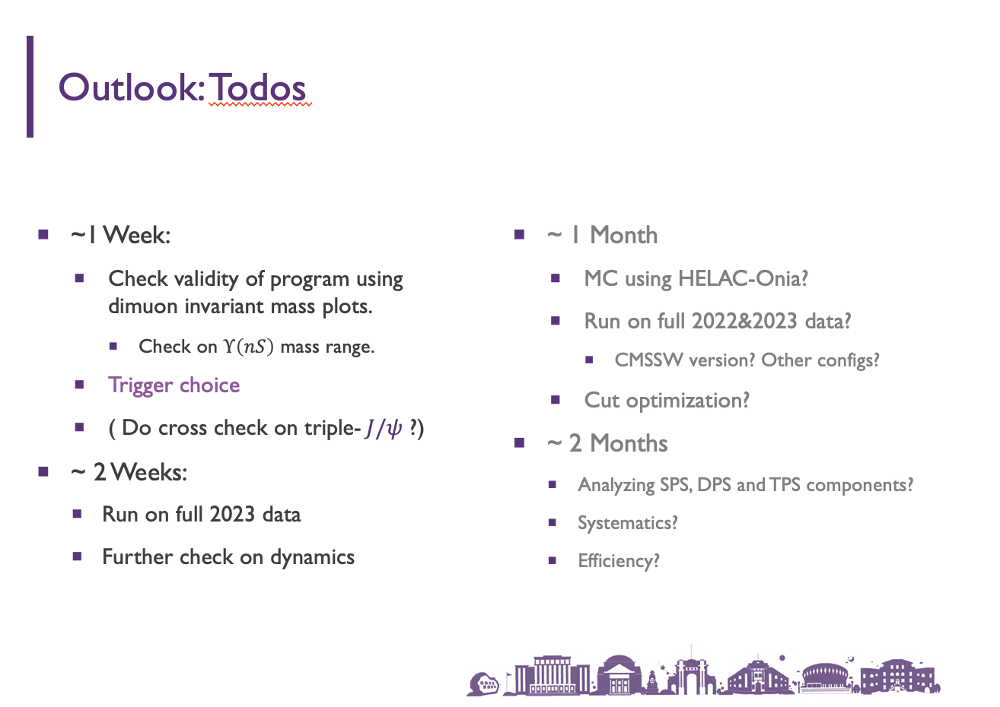

# Triple meson workbook

## Searching for $J/\psi+J/\psi+\Upsilon$ : Looking at individual mass spectra first

### Previous Report (16 Jan. 2025)




### Dataset and Triggering

Dataset: `ParkingDoubleMuonLowMass[0-7]`

Trigger: in parallel:

* `HLT_Trimuon5_3p5_2_Upsilon_Muon_v`
* `HLT_Dimuon0_Jpsi3p5_Muon2_v`
* `HLT_DoubleMu4_3_LowMass_v`

### Selections

#### "Default" cut for $J/\psi$

* $p_{T} > 6\mathrm{GeV/c}$

* $|\eta| < 2.5$

#### "Default" cut for $\mu^{\pm}$ 

* For $|\eta| < 1.2$, require $p_T > 2.5 \mathrm{GeV/c}$
* For $1.2 < |\eta| < 2.5$, require $p_T > 3.5 \mathrm{GeV/c}$
* Muon ID: soft

#### "Default" cut for vertices

Require a minimal probability of 1%

#### "Default" cut result: 


Significance for both $J/\psi$, almost no signal in $\Upsilon$ . 

#### Trying cut conditions for $\Upsilon$ (one attempt / 150)

Ups_pt 4.0; Ups_mu_pt 4.0; loose


Low yield. Looking into setting upper limit for Xsec.


## Searching for $J/\psi+J/\psi+\phi$ : Looking at individual mass spectra first

#### "Default" cut for tracks (assumed to be $K^{\pm}$)

* $p_T > 0.5\mathrm{GeV/c}$

* $|\eta| < 2.5$

#### "Default" cut for $\phi$

* $p_T > 2\mathrm{GeV/c}$

* $|\eta| < 2.5$

#### "Default" result


## Searching for $J/\psi+\Upsilon+\phi$ : Looking on individual mass spectra first

#### "Default" cut result:


What the ???


## To resolve:

1. Sorting out multiple candidate. The mass difference might not be goot enough. VtxProb ? $\sum p_T$ ? Also evaluate by doing "best-second-best-comparison"?
2. Correlation matters. Check how $m_{KK}$ peak might change under different VtxProb threshold.
3. Which particle "fires the trigger"? Have a look. Would backgorund from Jpsi trigger on upsilon mass region cause further issue?
4. $\Delta R$ cuts? (may not be as effective)
5. MC studies for characteristics?

## 18 Feb. 2025：来自Alexis和Nuno的建议

### From Alexis

1. 关于multiple candidate的处理方法：贪心算法可能是好的，但是使用的指标可能要另选。$\sum\left[(m_{fit}-m_{\mathrm{PDG}})/(\sigma_{m,fit})\right]^2$作为判据的话，本底的形状很可能会被扭曲（“假峰”），不变质量谱拟合就可能变得不可靠。替代的指标是$\sum p_T$, VtxProb。

2. 续上条，如何判断我们的指标好不好？看看“次优选”和“最优选”的差别如何分布。如果“平滑地差很大”，问题不大(?)

3. 问：使用主要适用于$J/\psi$的trigger，可能是Upsilon信号不显著的原因吗？答：先看看trigger情况。看看触发这个事例的HLT是哪一个，以及是哪些末态粒子参与触发。

    > Q： 如果先去做循环，找Upsilon，可能改善吗？

4. 对于$J/\psi+J/\psi+\phi$，在能够通过加cut找到双$J/\psi$的前提下，考虑在$m_{\mu\mu}$加了质量窗以后，再看看$m_{KK}$。不仅如此，逐渐提升VtxProb阈值，看看$\phi$峰面积如何变化。

5. 对于$\phi$，$K^{\pm}$的$p_T$可以这样约束：对于横动量较大的，要求0.7以上；对于较小的，要求0.5以上。

6. 看看MC。用HELAC-ONIA。

    > Remark: 和赵一扬一起做。必要时联系邵华圣老师（Helac-Onia开发者）以及Alexis.

### From Nuno

1. 我们的径迹拟合结构合适吗？只有$J/\psi$有non-prompt分量，那么$\Upsilon$是不是应该直接把$\mu^{\pm}$往初始顶点拟合，$\phi$是不是应该直接把$K^{\pm}$往初始顶点拟合？

2. $J/\psi$的non-prompt分量用顶点拟合方法合适吗？如果是b-decay，衰变产生的其他粒子带走的动量，会不会影响我们的vertexing？

    > 做得松一点？non-prompt其实寿命也没有太长

3. 有必要尝试复现$3J/\psi$的分析流程吗？

4. 我们处理primary vertex的方式似乎有问题。参考$3J/\psi$的Analysis note。即使是有pileup，我们仍然能判断出有一些“真实的对撞顶点”，我们的primary vertex应该能够归于其中？

    > 
    >
    > (From 3J Analysis Note)，可以以后再看

5. 其他可以参考的分析：single- or double-$J/\psi$ + $\phi$ 

6. 看看MC。看看pT等物理量在信号中的分布。

## 20 Feb. 2025 尝试看$J/\psi+\Upsilon+\phi$的一些数据特征

### Trigger

> 这个地方，我们有保留全部的事例吗？是不是那些没有相应HLT的事例已经被丢掉了？

选择`ParkingDoubleMuonLowMass7`在`Run2023D`期间数据，得到以下结果：

```
Number of events: 152176

Number of events triggered by JpsiTrig: 141796
Number of events triggered by UpsTrig:  5932
Number of events triggered by both JpsiTrig and UpsTrig: 0

Number of candidates: 748952
Number of candidates with Jpsi muons that lead to JpsiTrig full: 426603
Number of candidates with Jpsi muons that lead to JpsiTrig mono: 165475
Number of candidates with Jpsi muons that lead to UpsTrig full:  2255
Number of candidates with Jpsi muons that lead to UpsTrig mono:  20568
Number of candidates with Ups muons that lead to JpsiTrig full: 8260
Number of candidates with Ups muons that lead to JpsiTrig mono: 314793
Number of candidates with Ups muons that lead to UpsTrig full:  21648
Number of candidates with Ups muons that lead to UpsTrig mono:  12432
```

如何解读？

我们看Trigger想要回答的问题是，通过了“$J/\psi$触发条件”的事例，是不是会给$\Upsilon$的质量区间，带来较大本底，以至于这些本底的涨落，能够淹没$\Upsilon$信号。

所以是不是可以考虑作这样一组图：只保留通过$\Upsilon$触发条件的事例，检查他们的不变质量谱？

> 看看保留了哪些Trigger，尝试一下高pT Upsilon trigger
>
> 看看不加顶点限制的Upsilon （1S, 2S, 3S）
