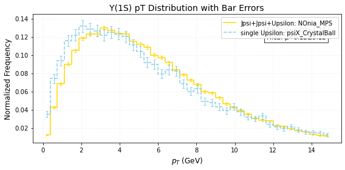

# Triple meson workbook

## Searching for $J/\psi+J/\psi+\Upsilon$ : Looking at individual mass spectra first

### Previous Report (16 Jan. 2025)


### Dataset and Triggering

Dataset: `ParkingDoubleMuonLowMass[0-7]`

Trigger: in parallel:

* `HLT_Trimuon5_3p5_2_Upsilon_Muon_v`
* `HLT_Dimuon0_Jpsi3p5_Muon2_v`
* `HLT_DoubleMu4_3_LowMass_v`

### Selections

#### "Default" cut for $J/\psi$

* $p_{T} > 6\mathrm{GeV/c}$

* $|\eta| < 2.5$

#### "Default" cut for $\mu^{\pm}$ 

* For $|\eta| < 1.2$, require $p_T > 2.5 \mathrm{GeV/c}$
* For $1.2 < |\eta| < 2.5$, require $p_T > 3.5 \mathrm{GeV/c}$
* Muon ID: soft

#### "Default" cut for vertices

Require a minimal probability of 1%

#### "Default" cut result: 


Significance for both $J/\psi$, almost no signal in $\Upsilon$ . 

#### Trying cut conditions for $\Upsilon$ (one attempt / 150)

Ups_pt 4.0; Ups_mu_pt 4.0; loose


Low yield. Looking into setting upper limit for Xsec.


## Searching for $J/\psi+J/\psi+\phi$ : Looking at individual mass spectra first

#### "Default" cut for tracks (assumed to be $K^{\pm}$)

* $p_T > 0.5\mathrm{GeV/c}$

* $|\eta| < 2.5$

#### "Default" cut for $\phi$

* $p_T > 2\mathrm{GeV/c}$

* $|\eta| < 2.5$

#### "Default" result


## Searching for $J/\psi+\Upsilon+\phi$ : Looking on individual mass spectra first

#### "Default" cut result:


What the ???


## To resolve:

1. Sorting out multiple candidate. The mass difference might not be goot enough. VtxProb ? $\sum p_T$ ? Also evaluate by doing "best-second-best-comparison"?
2. Correlation matters. Check how $m_{KK}$ peak might change under different VtxProb threshold.
3. Which particle "fires the trigger"? Have a look. Would backgorund from Jpsi trigger on upsilon mass region cause further issue?
4. $\Delta R$ cuts? (may not be as effective)
5. MC studies for characteristics?

## 18 Feb. 2025：来自Alexis和Nuno的建议

### From Alexis

1. 关于multiple candidate的处理方法：贪心算法可能是好的，但是使用的指标可能要另选。$\sum\left[(m_{fit}-m_{\mathrm{PDG}})/(\sigma_{m,fit})\right]^2$作为判据的话，本底的形状很可能会被扭曲（“假峰”），不变质量谱拟合就可能变得不可靠。替代的指标是$\sum p_T$, VtxProb。

2. 续上条，如何判断我们的指标好不好？看看“次优选”和“最优选”的差别如何分布。如果“平滑地差很大”，问题不大(?)

3. 问：使用主要适用于$J/\psi$的trigger，可能是Upsilon信号不显著的原因吗？答：先看看trigger情况。看看触发这个事例的HLT是哪一个，以及是哪些末态粒子参与触发。

    > Q： 如果先去做循环，找Upsilon，可能改善吗？

4. 对于$J/\psi+J/\psi+\phi$，在能够通过加cut找到双$J/\psi$的前提下，考虑在$m_{\mu\mu}$加了质量窗以后，再看看$m_{KK}$。不仅如此，逐渐提升VtxProb阈值，看看$\phi$峰面积如何变化。

5. 对于$\phi$，$K^{\pm}$的$p_T$可以这样约束：对于横动量较大的，要求0.7以上；对于较小的，要求0.5以上。

6. 看看MC。用HELAC-ONIA。

    > Remark: 和赵一扬一起做。必要时联系邵华圣老师（Helac-Onia开发者）以及Alexis.

### From Nuno

1. 我们的径迹拟合结构合适吗？只有$J/\psi$有non-prompt分量，那么$\Upsilon$是不是应该直接把$\mu^{\pm}$往初始顶点拟合，$\phi$是不是应该直接把$K^{\pm}$往初始顶点拟合？

2. $J/\psi$的non-prompt分量用顶点拟合方法合适吗？如果是b-decay，衰变产生的其他粒子带走的动量，会不会影响我们的vertexing？

    > 做得松一点？non-prompt其实寿命也没有太长

3. 有必要尝试复现$3J/\psi$的分析流程吗？

4. 我们处理primary vertex的方式似乎有问题。参考$3J/\psi$的Analysis note。即使是有pileup，我们仍然能判断出有一些“真实的对撞顶点”，我们的primary vertex应该能够归于其中？

    > 
    >
    > (From 3J Analysis Note)，可以以后再看

5. 其他可以参考的分析：single- or double-$J/\psi$ + $\phi$ 

6. 看看MC。看看pT等物理量在信号中的分布。

## 20 Feb. 2025 尝试看$J/\psi+\Upsilon+\phi$的一些数据特征

### Trigger

> 这个地方，我们有保留全部的事例吗？是不是那些没有相应HLT的事例已经被丢掉了？

选择`ParkingDoubleMuonLowMass7`在`Run2023D`期间数据，得到以下结果：

```
Number of events: 152176

Number of events triggered by JpsiTrig: 141796
Number of events triggered by UpsTrig:  5932
Number of events triggered by both JpsiTrig and UpsTrig: 0

Number of candidates: 748952
Number of candidates with Jpsi muons that lead to JpsiTrig full: 426603
Number of candidates with Jpsi muons that lead to JpsiTrig mono: 165475
Number of candidates with Jpsi muons that lead to UpsTrig full:  2255
Number of candidates with Jpsi muons that lead to UpsTrig mono:  20568
Number of candidates with Ups muons that lead to JpsiTrig full: 8260
Number of candidates with Ups muons that lead to JpsiTrig mono: 314793
Number of candidates with Ups muons that lead to UpsTrig full:  21648
Number of candidates with Ups muons that lead to UpsTrig mono:  12432
```

如何解读？

我们看Trigger想要回答的问题是，通过了“$J/\psi$触发条件”的事例，是不是会给$\Upsilon$的质量区间，带来较大本底，以至于这些本底的涨落，能够淹没$\Upsilon$信号。

所以是不是可以考虑作这样一组图：只保留通过$\Upsilon$触发条件的事例，检查他们的不变质量谱？

> 看看保留了哪些Trigger，尝试一下高pT Upsilon trigger
>
> 看看不加顶点限制的Upsilon （1S, 2S, 3S）

## 25 Feb. 2025

### Upsilon spectrum.

Actually, even with all triggers and a limited amount of data (~ 32k Event), Upsilon proved clearly visible.


That is without applying cuts, yet the peaks of $\Upsilon(1S),\Upsilon (2S), \Upsilon(3S) $ have become readily visible. We shall say with much confidence that we can find $\Upsilon$ mesons pretty well.

We rule out the "Upsilon smeared by background from Jpsi trigger data" hypothesis.

### Vertexing of Mesons

Vertexing to reconstruct intermidiate particles ($J/\psi, \Upsilon, \phi$) is crucial, yet it might not be the case if we impose strict limits on the vertexing between the intermidiate particles.

In the triple-$J/\psi$ analysis note (CMS AN-20-146), the authors did not apply vertexing restrictions in the "triple-$J/\psi$" fit. Instead, they used the `fromPV()` and `pvAssociationQuality()` attributes of the final-state muons. This restriction alone is able to reduce the effect of pileup greatly in Run 2.

#### New Idea: Using `fromPV()` and `pvAssociationQuality()` Attributes of the Final-state Particles

In producing the final-state particles, we weaken the vertexing restrictions, and instead use the `fromPV()` and `pvAssociationQuality()` attributes of the final-state particles to filter out the pileup.

For $J/\psi + J/\psi + \Upsilon$ analysis, we require the following for vertexing in producing ntuples.

* vertexing for $J/\psi \rightarrow \mu^+ + \mu^-$ : require > 1% probability (as is required before)
* vertexing for $\Upsilon \rightarrow \mu^+ + \mu^-$: require > 1% probability (as is required before)
* $\mu^\pm$  `fromPV()`: 2 or 3

For $J/\psi + J/\psi + \phi$ analysis, we require the following for vertexing in producing ntuples.

* vertexing for $J/\psi \rightarrow \mu^+ + \mu^-$ : require > 1% probability (as is required before)
* vertexing for $\phi \rightarrow K^+ + K^-$: require > 1% probability (as is required before)
* vertexing for $J/\psi + J/\psi$: require a valid fit.
* $\mu^\pm$ & $K^\pm$  `fromPV()` : 2 or 3

For $J/\psi + \Upsilon + \phi$ analysis, we require the following for vertexing in producing ntuples.

* vertexing for $J/\psi \rightarrow \mu^+ + \mu^-$ : require > 1% probability (as is required before)
* vertexing for $\Upsilon \rightarrow \mu^+ + \mu^-$: require > 1% probability (as is required before)
* vertexing for $\phi \rightarrow K^+ + K^-$: require > 1% probability (as is required before)
* $\mu^\pm$ & $K^\pm$  `fromPV()` : 2 or 3

While making such changes, it is still important to keep a record of the "triple-meson" vertex fitting. We may still need it for future filtering.

#### Possible Implementation with CMSSW code in `TPS-Onia2MuMu`

##### Extracting `fromPV()` and `pvAssociationQuality()` attributes of the muons

The `pat::Muon` does not have `fromPV()` and `pvAssociationQuality()` attributes by itself. However, given that the `pat::Muon` is associated with a `pat::PackedCandidate` as a track, we can use the `pat::PackedCandidate` to extract these attributes.

Luckily, there is already a loop designed to loop over the `pat::PackedCandidate` to remove the muon tracks from the list of all tracks. We can add the extraction of `fromPV()` and `pvAssociationQuality()` attributes in this loop.

```cpp
for (edm::View<pat::Muon>::const_iterator iMuonP  = thePATMuonHandle->begin();
		                                  iMuonP != thePATMuonHandle->end();
                                        ++iMuonP)
	{
        try{
		     /*****************************
		    * Some muon properties here.
		    *****************************/
		    for (std::vector<edm::View<pat::PackedCandidate>::const_iterator>::const_iterator iTrackfID  = nonMuonPionTrack.begin();
		                                                                                      iTrackfID != nonMuonPionTrack.end(); 
                                                                                            ++iTrackfID                             )
		    {
                try{
		    	    if(iMuonP->track().isNull()){
		    	    	continue;
		    	    }
		    	    edm::View<pat::PackedCandidate>::const_iterator iTrackf = *(iTrackfID);
		    	    iMuonP->track()->px();
                    // Match using the momentum. [Annotated by Eric Wang, 20240704]                  
		    	    if (   iTrackf->px() == iMuonP->track()->px() 
                        && iTrackf->py() == iMuonP->track()->py() 
                        && iTrackf->pz() == iMuonP->track()->pz()) {
                        // [New Code] Here we can extract the fromPV() and pvAssociationQuality() attributes of the muon.
                        muFromPV->push_back(iTrackf->fromPV());
                        muPVAssociationQuality->push_back(iTrackf->pvAssociationQuality());
                        // [End of New Code]
		    	    	nonMuonPionTrack.erase(iTrackfID);
		    	    	iTrackfID = iTrackfID - 1;
		    	    }
                } catch(...){
                    continue;
                }
		    }
		    /*****************************
		    * Some Trigger matching here
		    *****************************/
            } catch(...){
                continue;
            }
	}
```

##### Extracting `fromPV()` and `pvAssociationQuality()` attributes of the $K^{\pm}$ tracks

For the $K^{\pm}$ tracks, we can do the extraction directly from the `pat::PackedCandidate` object, yet we can only save this for the $K^{\pm}$ tracks that are picked as candidates for the $\phi$ meson.

In storing the $K^{\pm}$ tracks, we can add the extraction of `fromPV()` and `pvAssociationQuality()` attributes.

```cpp
// Kaon 1
Phi_K_1_px->push_back(nonMuonPionTrack[KPair_Phi->second[0]]->px());
Phi_K_1_py->push_back(nonMuonPionTrack[KPair_Phi->second[0]]->py());
Phi_K_1_pz->push_back(nonMuonPionTrack[KPair_Phi->second[0]]->pz());
Phi_K_1_pt->push_back(nonMuonPionTrack[KPair_Phi->second[0]]->pt());
Phi_K_1_eta->push_back(nonMuonPionTrack[KPair_Phi->second[0]]->eta());
Phi_K_1_phi->push_back(nonMuonPionTrack[KPair_Phi->second[0]]->phi());
// [New Code] extracting fromPV() and pvAssociationQuality() attributes
Phi_K_1_fromPV->push_back(nonMuonPionTrack[KPair_Phi->second[0]]->fromPV());
Phi_K_1_pvAssociationQuality->push_back(nonMuonPionTrack[KPair_Phi->second[0]]->pvAssociationQuality());
// [End of New Code]
```

##### Supplimentary: Storing the `fromPV()` and `pvAssociationQuality()` attributes in the TTree

Apparently, these new atrributes require new branches in the TTrees. We can add these branches in the `TPS-Onia2MuMu` analyzer.

In `src/MultiLepPAT.h`, when declaring the `MultiLepPAT` class:

```cpp
//...
vector<int>         *muIsPatLooseMuon, *muIsPatTightMuon, *muIsPatSoftMuon, *muIsPatMediumMuon;
// [New Code] Adding the new branches for fromPV() and pvAssociationQuality() of muons.
vector<int>         *muFromPV, *muPVAssociationQuality;
// [End of New Code]
//...
```

For the $K^{\pm}$ tracks, we can add the branches in the corresponding place in the declaration of `MultiLepPAT`:
```cpp
//...
vector<float>       *Phi_K_2_eta, *Phi_K_2_phi, *Phi_K_2_pt;
// [New Code] Adding the new branches for fromPV() and pvAssociationQuality() of K^{\pm} tracks.
vector<int>         *Phi_K_1_fromPV, *Phi_K_1_pvAssociationQuality;
vector<int>         *Phi_K_2_fromPV, *Phi_K_2_pvAssociationQuality;
// [End of New Code]
//...
```

In `src/MultiLepPAT.cc`, when constructing `MultiLepPAT`:

> Reminder 1: despite being `enum` types in the `pat::PackedCandidate`, `fromPV()` and `pvAssociationQuality()` are stored as `int` in the `pat::PackedCandidate`. 
>
> Reminder 2: when initializing the branches in the constructor, the order of the branches should be consistent with the order of the variables in the class declaration.

```cpp
//... 
muIsPatLooseMuon(0), muIsPatTightMuon(0), muIsPatSoftMuon(0), muIsPatMediumMuon(0),
// [New Code] Adding the new branches for fromPV() and pvAssociationQuality() of muons.
muFromPV(0), muPVAssociationQuality(0),
// [End of New Code]
```

For the $K^{\pm}$ tracks, we can add the branches in the corresponding place in the constructor of `MultiLepPAT`:

```cpp
//...
Phi_K_2_eta(0), Phi_K_2_phi(0), Phi_K_2_pt(0),
// [New Code] Adding the new branches for fromPV() and pvAssociationQuality() of K^{\pm} tracks.
Phi_K_1_fromPV(0), Phi_K_1_pvAssociationQuality(0),
Phi_K_2_fromPV(0), Phi_K_2_pvAssociationQuality(0),
//...
```

In `src/MultiLepPAT.cc`, after filling the branches into the TTree:

```cpp
//...
muIsPatMediumMuon->clear();
// [New Code] Filling the new branches for fromPV() and pvAssociationQuality() of muons.
muFromPV->clear();
muPVAssociationQuality->clear();
// [End of New Code]
//...
```

For the $K^{\pm}$ tracks, we have to clear also:

```cpp
//...
Phi_K_2_eta->clear();
// [New Code] Filling the new branches for fromPV() and pvAssociationQuality() of K^{\pm} tracks.
Phi_K_1_fromPV->clear();
Phi_K_1_pvAssociationQuality->clear();
Phi_K_2_fromPV->clear();
Phi_K_2_pvAssociationQuality->clear();
//...
```

In `MultiLepPAT::beginJob()`, we have to initialize the new branches:

```cpp
//...
X_One_Tree->Branch("muIsPatMediumMuon", &muIsPatMediumMuon);
// [New Code] Adding the new branches for fromPV() and pvAssociationQuality() of muons.
X_One_Tree->Branch("muFromPV", &muFromPV);
X_One_Tree->Branch("muPVAssociationQuality", &muPVAssociationQuality);
// [End of New Code]
//...
```

For the $K^{\pm}$ tracks, we have to initialize the new branches:

```cpp
//...
X_One_Tree->Branch("Phi_K_2_eta", &Phi_K_2_eta);
// [New Code] Adding the new branches for fromPV() and pvAssociationQuality() of K^{\pm} tracks.
X_One_Tree->Branch("Phi_K_1_fromPV", &Phi_K_1_fromPV);
X_One_Tree->Branch("Phi_K_1_pvAssociationQuality", &Phi_K_1_pvAssociationQuality);
X_One_Tree->Branch("Phi_K_2_fromPV", &Phi_K_2_fromPV);
X_One_Tree->Branch("Phi_K_2_pvAssociationQuality", &Phi_K_2_pvAssociationQuality);
//...
```

## 5 Mar. 2025

### 关于顶点拟合的判据

比照triple-$J/\psi$的Analysis Note (AN2020-146)，尝试复现`fromPV`和`pvAssociationQuality`这两个属性作为判据的做法，然而始终没办法一一匹配。中间发CMS Talk的post，发完得知相似的问题近两周已经有人问过BPH Muon Contact；MUO POG的Matteo给出了和之前相同的建议，但是建议的三种方法好像都行不通。

最后我们将条件放宽到$J/\psi+J/\psi+\Upsilon$的顶点拟合只要求`isValid()`进行尝试，


> # Retrieving `fromPV` and `pvAssociationQuality` Properties of Muons
>
> Dear MUO POG experts,
>
> I have a framework for reconstructing some rare events which contain $J/\psi$ mesons each decaying into a pair of oppositely-charged muons from miniAOD data files. Currently, we would like to uitilize the `fromPV()` and `pvAssociationQuality()` properties to apply a not-so-strict vertexing selection to the event. Those properties, however, seem only implemented in `pat::PackedCandidate` class but not in `pat::Muon`. We have tried matching the objects by comparing the momenta of the particles and/or PDG IDs. However, we have some doubts over the validity of such methods since we have observed some unmatched muons.
>
> We have checked on the definition of `pat::PackedCandidate` and `pat::Muon` and could not find inheritance or pointer relations between the `pat::Muon` and the corresponding `pat::PackedCandidate` . 
>
> Therefore, I would like to ask if there is a fully reliable way of doing such matching or directly retirieving the `fromPV` and `pvAssociationQuality` properties of muons.
>
> Many thanks in advance for your help.
>
> Chi Wang
>
> 
>
> > Dear Chi Wang,
> > Indeed this is not an obvious question, since the `pat::Muon` collections do not have a `fromPV`member. Maybe the authors of the previous version of the analysis can share with you their code or shed some light on this information they gave, since (at least to my knowledge) the `fromPV`was never a member of the `pat::Muon` class, so they must have retrieved it in some other way.
> >
> > After a quick search in CMSSW, it seems that you should be able to access this information by doing:
> >
> > ```
> > const pat::PackedCandidatePtr aspacked(mu)
> > aspacked->fromPV()
> > ```
> >
> > Similarly to what is done here [1](https://github.com/cms-sw/cmssw/blob/master/RecoMuon/MuonIsolation/plugins/MuonPFIsolationWithConeVeto.cc#L51-L59).
> >
> > However, this takes as input a `reco::CandidatePtr&`, so I am not sure this works with a `pat::Muon`.
> >
> > An alternative approach would be to take a `reco::Candidate` (so probably your `pat::Muon`) and the PV in the event and build a new `PackedCandidate` using its constructor [2](https://github.com/cms-sw/cmssw/blob/master/DataFormats/PatCandidates/interface/PackedCandidate.h#L75).
> >
> > At this point, you should be able to use `fromPV()` on this object.
> >
> > Another possible solution could be to re-implement in your code the corresponding functions [3](https://github.com/cms-sw/cmssw/blob/master/DataFormats/PatCandidates/interface/PackedCandidate.h#L718-L752), so that you can call them also for a `pat::Muon`.
> >
> > More on a practical side, I am wondering why you need to use this information to select muons based on the tracks quality. For muons we already store the `dxy`, `dz`, and `SIP3D` parameters (and their errors). If your goal is to select “good” muons with respect to the primary vertex, wouldn’t be better (or at least equivalent) to use directly these observables? Maybe I am missing something that is more PAG-specific.
> >
> > I hope some of this can help.
> >
> > Best,
> >
> > Matteo for MUO
>
> Dear Matteo,
>
> Much thanks for your help!
>
> Indeed this selection criteria is somehow BPH-specific. We are trying to reproduce the selection in BPH-21-004, which used the `fromPV()` and `pvAssociationQuality` to select "good muons". We have also reached out to the BPH muon contact, who have received similar questions and showed your answer to that question.
>
> So far, we have experimented with some solutions you have proposed. Constructing `PackedCandidatePtr` from `pat::Muon` directly would result in the exception below for the majority of the muons.
>
> > RefCore: A request to resolve a reference to a product of type '`reco::Candidate`' with `ProductID` '3:3421' can not be satisfied because the product cannot be found.
> > Probably the branch containing the product is not stored in the input file.
>
> Building a `pat::PackedCandidate` from `pat::Muon` and the PV would not result in exceptions, yet the `pvAssociationQuality` all gave 0. We believe that, in the process of building `pat::PackedCandidate` when making `miniAOD`, some `qualityFlags_` are assigned to the candidate. This assignment is based on the primary vertex fitting process and it would be difficult, if not impossible, to retrieve such information through other methods. For similar reasons, we believe re-implementing the functions won't give satisfactory results.
>
> At the moment, we are trying out some other strategies to do the selection, perhaps also referring to other analyses involving reconstruction of non-prompt $J/\psi$ or other particles.
>
> Thank you once again for your suggestion.
>
> Best,
>
> Chi Wang
>
> 


### Bug fix: $J/\psi+ J/\psi + \Upsilon$ 和$J/\psi+\Upsilon+\phi$在产生Ntuple之后的处理

在我们的`Makefile`里面几乎是偶然地发现了一些“令人汗毛倒竖”的问题，而且在$J/\psi+\Upsilon+\phi$的workspace里面也存在。

之前我们为了生成各个job对应的`runPreCut.C`文件，我们使用了形如这样的代码：

```Makefile
preCut/jobs_$(suffix)/%/runPreCut.C: preCut/runPreCut.C config/datalist.txt preCut/preCut.C
    mkdir -p $(dir $@)
    echo $@ | sed -r -e "s|preCut/jobs_$(suffix)\/(.*Run)([0-9]{4,4})(.*)\/runPreCut.C$$|$(rootNtupleDir)/P_Run\2_$(suffix)/\1\2\3.root|g"
    cat tmp_file.txt
    sed -e "s|JOB_DATA|`cat tmp_file.txt`|g" $< | sed -r -e "s|\/\/\W*#define RUN_JOB|#define RUN_JOB|g" > $@
```

这样一个用`tmp_file.txt`“倒一手”的办法，看似避免了一些超长行，实际上带来了一个“跨线程安全性”的问题：如果两个job同时在生成`runPreCut.C`文件，那么`tmp_file.txt`就会被同时写入，导致文件内容混乱。在实际运行中，我们在检查生成的`runPreCut.C`文件时，发现他们的`JOB_DATA`和文件夹对应的job不一致。由此，我们才发现了这一问题。

我们最后用一种套娃的办法解决了这个问题：

```Makefile
preCut/jobs_$(suffix)/%/runPreCut.C: preCut/runPreCut.C config/datalist.txt preCut/preCut.C
	mkdir -p $(dir $@)
	sed -e "s|JOB_DATA|$(shell echo $@ | sed -r -e "s|preCut/jobs_$(suffix)\/(.*Run)([0-9]{4,4})(.*)\/runPreCut.C$$|$(rootNtupleDir)/P_Run\2_$(suffix)/\1\2\3.root|g")|g" $< | sed -r -e "s|\/\/\W*#define RUN_JOB|#define RUN_JOB|g" > $@
```

不得不说，这样还是造成了一个超长行，但起码把代码改对了...

这样带来的后果之一，就是之前我们画的很多图都必须丢掉...它们里面可能重复绘制了一些candidate而遗漏了另一些，实际上放大了一些本底涨落。

### HELAC-Onia MC Production

继续修bug，而且没有太多进展。

现在正在和陈诗洋学长沟通，一起处理这个问题。

CMS Induction Event里面Phat Srimanobhas提到过这样一个问题：我们从GEN一直到RECO放在同一个python文件做可能出bug。

经过分布运行排查，我们把问题定位到GEN这一步，并且暂时排除了GEN一直到RECO使用同个配置文件的直接风险，但是之后就几无进展。

## 6 Mar. 2024

昨天的bug修完了以后，出来了一些蛮漂亮的数据。虽然还没有做三维拟合，而且仅仅用了2023数据（$\mathcal{L}\approx 27 \space\mathrm{fb^{-1}}$），但是足以看到这个：


### 筛选条件：

#### "Default" cut for $J/\psi$

* $p_{T} > 6\mathrm{GeV/c}$

* $|\eta| < 2.5$

#### "Default" cut for $\mu^{\pm}$ 

* For $|\eta| < 1.2$, require $p_T > 2.5 \mathrm{GeV/c}$
* For $1.2 < |\eta| < 2.5$, require $p_T > 3.5 \mathrm{GeV/c}$
* Muon ID: soft

#### Vertices

* For quarkonia decay vertices, require at least 1%
* For triple quarkonia vertex, require a "valid" fit.

#### Attempted cut for $\Upsilon$

* $p_T > 2\space \mathrm{GeV/c}$
* $|\eta| < 2.5$
* muons: $p_T > 3\space \mathrm{GeV/c}$


## 8 Mar. 2025

现在是已经复现出来了$J/\psi+\Upsilon$的GEN-SIM，尝试了$J/\psi+J/\psi+\Upsilon$ GEN-SIM的各种参数调整，还是没有显著改善。

一些错误日志和LHE文件片段刚才喂给了DeepSeek，看到了这样的建议：

> 我在尝试用Pythia8对Helac-Onia产生的J/psi+J/psi+Upsilon事例处理衰变和强子化，遇到了这些pythia报错以及cmsException，请为我综合解读：
> Pythia报错：
>
> ```
> PYTHIA Warning in Pythia::check: energy-momentum not quite conserved  
>  PYTHIA Error in Pythia::check: mismatch in daughter and mother lists  
>  PYTHIA Error in Pythia::next: check of event revealed problems  
> ```
>
> cmsException:
>
> ```
> ----- Begin Fatal Exception 08-Mar-2025 06:43:03 CET-----------------------
> An exception of category 'StdException' occurred while
>    [0] Processing  Event run: 1 lumi: 1 event: 1 stream: 0
>    [1] Running path 'recosim_step'
>    [2] Calling method for module Pythia8ConcurrentHadronizerFilter/'generator'
> Exception Message:
> A std::exception was thrown.
> vector::_M_range_check: __n (which is 1114112) >= this->size() (which is 38)
> ----- End Fatal Exception -------------------------------------------------
> ```
>
>
> （由于技术原因，联网搜索暂不可用）
>
> ---
>
> ### **问题分析与解决方案**
>
> 您成功处理了 **J/ψ + Υ** 事例但失败于 **J/ψ + J/ψ + Υ** 事例，根本原因可能是 **多个J/ψ粒子的处理逻辑冲突** 或 **Pythia对复杂衰变链的支持不足**。以下是具体分析与解决方案：
>
> ---
>
> ### **1. 核心问题分析**
> #### **（1）多J/ψ粒子的母子关系冲突**
> - **现象**：  
>   当事件中存在多个J/ψ时，Pythia可能无法正确关联每个J/ψ的衰变产物（如μ子对），导致母子列表不匹配（`mismatch in daughter and mother lists`）。  
> - **原因**：  
>   - LHE文件中多个J/ψ的**状态码（status code）未正确标记为中间粒子**（应为 `status=2`）。  
>   - 强制衰变设置（如 `443:onIfMatch = 13 -13`）可能未正确区分不同J/ψ的衰变通道，导致索引混乱。
>
> #### **（2）四动量守恒的数值敏感性**
> - **现象**：  
>   多粒子系统的四动量守恒检查更敏感，轻微数值误差可能被放大（如 `energy-momentum not quite conserved`）。  
> - **原因**：  
>   - Helac-Onia生成的事件中存在四动量近似但非严格守恒的情况（例如，高能碰撞中数值舍入误差）。  
>   - Pythia的强子化过程（如初态辐射ISR）在多粒子场景中引入额外动量扰动。
>
> #### **（3）CMSSW并发处理的竞争条件**
> - **现象**：  
>   `vector::_M_range_check` 错误在多J/ψ事件中更易触发。  
> - **原因**：  
>   `Pythia8ConcurrentHadronizerFilter` 在多线程处理时，可能因粒子索引分配冲突导致越界访问。
>
> ---
>
> ### **2. 分步解决方案**
>
> #### **（1）修正LHE文件的粒子状态码**
> 使用 `lhe_analyzer` 检查LHE文件，确保所有J/ψ（PID=443）和Υ（PID=553）的 **状态码为 `2`**（中间粒子），而非 `1`（末态粒子）。  
> **示例修正后的LHE事件片段**：  
> ```xml
> <event>
>   <!-- 初始质子（status=-1） -->
>   <particle pdgid="2212" ... status="-1" /> 
>   <particle pdgid="2212" ... status="-1" />
>   <!-- 中间J/ψ（status=2） -->
>   <particle pdgid="443" ... status="2" />
>   <particle pdgid="443" ... status="2" />
>   <!-- 中间Υ（status=2） -->
>   <particle pdgid="553" ... status="2" />
> </event>
> ```
>
> #### **（2）调整Pythia配置参数**
> 在CMSSW配置文件中修改以下参数以支持多J/ψ衰变：  
> ```python
> process.generator = cms.EDFilter("Pythia8ConcurrentHadronizerFilter",
>     PythiaParameters = cms.PSet(
>         processParameters = cms.vstring(
>             # 放宽四动量守恒检查的容差
>             "Check:epTolErr = 1e-3",          # 允许0.1%的动量误差
>             "Check:epTolWarn = 1e-4",          # 警告阈值设为0.01%
>             
>             # 禁用自动母子关系重建冲突的检查
>             "ProcessLevel:resonanceDecays = off",  
>             
>             # 明确指定每个J/ψ的独立衰变通道
>             "443:addChannel = 1 1.0 0 13 -13",  # J/ψ → μ+μ-
>             "443:addChannel = 1 1.0 0 11 -11",  # J/ψ → e+e-
>         ),
>     ),
> )
> ```
>
> #### **（3）强制单线程运行**
> 在CMSSW配置中禁用并发处理，排除多线程竞争：  
> ```python
> process.options.numberOfThreads = cms.untracked.uint32(1)
> process.options.numberOfStreams = cms.untracked.uint32(0)
> ```
>
> #### **（4）启用Pythia详细日志**
> 在配置中增加以下参数，定位具体错误事件：  
> ```python
> process.generator.pythiaHepMCVerbosity = cms.untracked.bool(True)
> process.generator.pythiaPylistVerbosity = cms.untracked.int32(4)
> ```
>
> #### **（5）验证多J/ψ事件的物理合理性**
> 确保Helac-Onia生成的 **J/ψ + J/ψ + Υ** 事件符合物理过程：  
> - 检查J/ψ的生成机制（如是否通过双胶子融合或双重产生过程）。  
> - 确认事件中不存在非物理的粒子关联（如J/ψ质量远低于PDG值）。
>
> ---
>
> ### **3. 高级调试步骤**
> #### **（1）对比独立Pythia运行结果**
> 编写独立脚本（不依赖CMSSW），验证多J/ψ事件是否可通过Pythia单独处理：  
> ```python
> import pythia8
> pythia = pythia8.Pythia()
> pythia.readString("Beams:frameType = 4")
> pythia.readString("Beams:LHEF = pp_jpsi_jpsi_upsilon.lhe")
> pythia.readString("443:onMode = 0")  # 关闭默认衰变
> pythia.readString("443:onIfMatch = 13 -13")  # 强制J/ψ → μμ
> pythia.init()
> for i in range(10):
>     if not pythia.next():
>         print(f"Error in event {i}: {pythia.info.errorMessage()}")
> ```
>
> #### **（2）使用Valgrind检测内存错误**
> 运行CMSSW进程时附加内存检查工具：  
> ```bash
> valgrind --tool=memcheck --leak-check=full cmsRun GEN2RECO_2023C_0.py
> ```
>
> #### **（3）提交最小复现案例**
> 若问题仍未解决，建议向CMSSW或Pythia团队提交包含以下内容的最小复现案例：  
> - 简化的LHE文件（仅包含2个J/ψ + 1个Υ）。  
> - 精简的CMSSW配置文件。  
> - Pythia详细日志和崩溃堆栈跟踪。
>
> ---
>
> ### **4. 总结**
> 问题根源可能是 **多J/ψ粒子的母子关系管理不当** 或 **并发处理导致的内存索引冲突**。通过修正LHE状态码、调整Pythia参数、强制单线程运行，应能解决大部分问题。若仍需进一步支持，请提供以下信息：  
> 1. 多J/ψ事件的LHE文件片段（脱敏后）。  
> 2. 启用Verbosity后的Pythia日志。  
> 3. Valgrind或GDB的输出结果。
>
>
> 如何手动检查J/ψ（PID=443）和Υ（PID=553）的 状态码？
>
> （由于技术原因，联网搜索暂不可用）
>
> ---
>
> ### **手动检查LHE文件中J/ψ（PID=443）和Υ（PID=553）状态码的方法**
>
> 以下是分步指南，帮助您快速定位LHE文件中粒子的状态码：
>
> ---
>
> #### **1. 直接查看LHE文件内容**
> LHE文件是XML格式的文本文件，每个事件中的粒子信息通过`<particle>`标签列出。具体步骤：  
> 1. **打开LHE文件**：  
>    ```bash
>    nano pp_sps_1000_10.lhe  # 使用任意文本编辑器（如nano、vim、VSCode等）
>    ```
> 2. **定位事件块**：  
>    搜索`<event>`标签，查看事件中的粒子列表。例如：  
>    ```xml
>    <event>
>      <particle pdgid="2212" ... status="-1" />  <!-- 初始质子 -->
>      <particle pdgid="2212" ... status="-1" />
>      <particle pdgid="443" ... status="2" />    <!-- J/ψ（中间粒子） -->
>      <particle pdgid="553" ... status="2" />    <!-- Υ（中间粒子） -->
>      <particle pdgid="13" ... status="1" />     <!-- μ子（末态粒子） -->
>      <particle pdgid="-13" ... status="1" />
>    </event>
>    ```
> 3. **检查目标粒子的`status`属性**：  
>    对于PID=443（J/ψ）和553（Υ），确认其`status`值是否为`2`（中间粒子）。
>
> ---
>
> #### **2. 使用命令行工具快速筛选**
> 在Linux终端中，使用`grep`命令提取包含目标PID的行及其状态码：  
> ```bash
> # 查找J/ψ（PID=443）的状态码
> grep -E '<particle.*pdgid="443".*status="([0-9-]+)"' pp_sps_1000_10.lhe
> 
> # 查找Υ（PID=553）的状态码
> grep -E '<particle.*pdgid="553".*status="([0-9-]+)"' pp_sps_1000_10.lhe
> ```
> **输出示例**：  
> ```xml
> <particle pdgid="443" ... status="2" />
> <particle pdgid="553" ... status="2" />
> ```
>
> ---
>
> #### **3. 编写Python脚本自动解析**
> 以下脚本可批量提取所有事件中J/ψ和Υ的状态码：  
> ```python
> import re
> 
> def check_particle_status(lhe_file, target_pids):
>     with open(lhe_file, 'r') as f:
>         content = f.read()
>     
>     # 匹配所有事件块
>     events = re.findall(r'<event>.*?</event>', content, re.DOTALL)
>     
>     for event_idx, event in enumerate(events, 1):
>         # 匹配所有粒子行
>         particles = re.findall(r'<particle.*?pdgid
> ```
>
> 请为我检查这个LHE文件片段：
>
> ```
> <LesHouchesEvents version="1.0">
> <!--
> File generated with HELAC-ONIA
> -->
> <init>
>     2212    2212  6.800000E+03  6.800000E+03       0       0   10000   10000       3       1
>     2.7662080351E+01    2.5337522149E-01    1.0000000000E+00    89
> </init>
> <event>
>     12    89  2.230813E-01  3.117787E+00  7.299270E-03  1.180000E-01
>       21   -1    0    0  101  103  0.0000000000E+00  0.0000000000E+00  4.6199574514E-03  4.6199574514E-03  0.0000000000E+00  0.000000E+00  9.0000E+00
>       21   -1    0    0  103  102  0.0000000000E+00  0.0000000000E+00 -7.8334029110E+02  7.8334029110E+02  0.0000000000E+00  0.000000E+00  9.0000E+00
>       21   -1    0    0  104  106  0.0000000000E+00  0.0000000000E+00  1.7928543551E+01  1.7928543551E+01  0.0000000000E+00  0.000000E+00  9.0000E+00
>       21   -1    0    0  106  105  0.0000000000E+00  0.0000000000E+00 -1.4255696338E+00  1.4255696338E+00  0.0000000000E+00  0.000000E+00  9.0000E+00
>       21   -1    0    0  107  109  0.0000000000E+00  0.0000000000E+00  5.7964683702E+00  5.7964683702E+00  0.0000000000E+00  0.000000E+00  9.0000E+00
>       21   -1    0    0  109  108  0.0000000000E+00  0.0000000000E+00 -3.3375461537E+01  3.3375461537E+01  0.0000000000E+00  0.000000E+00  9.0000E+00
>      443    1    1    2    0    0  1.0501487877E-01  3.5263268580E-01 -5.4250928147E+02  5.4251824031E+02  3.0960000000E+00  0.000000E+00  9.0000E+00
>       21    1    1    2  101  102 -1.0501487877E-01 -3.5263268580E-01 -2.4082638967E+02  2.4082667074E+02  0.0000000000E+00  0.000000E+00  9.0000E+00
>      443    1    3    4    0    0 -1.2640140999E+00  2.9675955077E+00  2.7971889936E+00  5.2738825364E+00  3.0960000000E+00  0.000000E+00  9.0000E+00
>       21    1    3    4  104  105  1.2640140999E+00 -2.9675955077E+00  1.3705784923E+01  1.4080230648E+01  0.0000000000E+00  0.000000E+00  9.0000E+00
>      553    1    5    6    0    0 -5.3164998534E+00 -8.6947425265E+00 -5.6859121219E+00  1.5023002065E+01  9.4603000000E+00  0.000000E+00  9.0000E+00
>       21    1    5    6  107  108  5.3164998534E+00  8.6947425265E+00 -2.1893081045E+01  2.4148927843E+01  0.0000000000E+00  0.000000E+00  9.0000E+00
> </event>
> ```
>
> （由于技术原因，联网搜索暂不可用）
>
> ### **检查结果**
>
> 在提供的LHE文件片段中，所有 **J/ψ（PID=443）** 和 **Υ（PID=553）** 的 **状态码（status）** 均为 **1**（末态粒子）。这与Pythia处理衰变的要求不符，需将其修正为 **2**（中间粒子）。以下是具体分析：
>
> ---
>
> ### **1. J/ψ（PID=443）的状态码**
> 在事件中，两个J/ψ粒子的状态码均为 `1`：  
> ```xml
> <!-- 第一个J/ψ（PID=443） -->
> <particle pdgid="443" status="1" ... />  
> <!-- 第二个J/ψ（PID=443） -->
> <particle pdgid="443" status="1" ... />  
> ```
> **问题**：  
> 状态码 `1` 表示该粒子是末态粒子，Pythia不会对其进一步衰变。若希望Pythia处理J/ψ的衰变（如J/ψ → μμ），需将其状态码设为 `2`（中间粒子）。
>
> ---
>
> ### **2. Υ（PID=553）的状态码**
> Υ粒子的状态码同样为 `1`：  
> ```xml
> <!-- Υ（PID=553） -->
> <particle pdgid="553" status="1" ... />  
> ```
> **问题**：  
> 状态码 `1` 导致Υ粒子被视为末态粒子，Pythia不会触发其衰变（如Υ → μμ或Υ → e⁺e⁻）。
>
> ---
>
> ### **3. 修正方法**
> 将J/ψ和Υ的 **状态码从 `1` 改为 `2`**：  
> ```xml
> <!-- 修正后的J/ψ -->
> <particle pdgid="443" status="2" ... />  
> <!-- 修正后的Υ -->
> <particle pdgid="553" status="2" ... />  
> ```
>
> ---
>
> ### **4. 验证修正后的LHE文件**
> 使用以下命令检查修正后的文件：  
> ```bash
> # 检查J/ψ状态码
> grep -E '443\s+2' pp_sps_1000_10.lhe
> 
> # 检查Υ状态码
> grep -E '553\s+2' pp_sps_1000_10.lhe
> ```
> **预期输出**：  
> 应显示所有J/ψ和Υ的 `status=2` 行。
>
> ---
>
> ### **5. 对Pythia配置的影响**
> 修正后，需确保Pythia配置中启用了对应粒子的衰变通道。例如：  
> ```python
> # 强制J/ψ衰变为μμ
> process.generator.PythiaParameters.processParameters.extend([
>     "443:onMode = 0",              # 关闭默认衰变
>     "443:onIfMatch = 13 -13",      # 允许J/ψ → μ+μ-
>     "553:onMode = 0",              # 关闭Υ默认衰变
>     "553:onIfMatch = 13 -13",      # 允许Υ → μ+μ-
> ])
> ```
>
> ---
>
> ### **总结**
> - **问题根源**：J/ψ和Υ的状态码错误标记为 `1`（末态粒子）。  
> - **解决方案**：将状态码修正为 `2`（中间粒子），并确保Pythia配置正确衰变通道。  
> - **验证工具**：使用 `grep` 或 `lhe_analyzer` 脚本检查修正后的文件。
>
> 但是之前我成功处理了J/psi+Y的事例文件，它的状态码似乎也不太对劲，以下是事例片段：
>
> ```
> <LesHouchesEvents version="1.0">
> <!--
> File generated with HELAC-ONIA
> -->
> <init>
>     2212    2212  6.500000E+03  6.500000E+03       0       0   10000   10000       3       1
>     1.0763596098E+01    2.8162585519E-02    1.0000000000E+00    82
> </init>
> <event>
>      4    85  1.335434E-02  6.466006E+00  7.299270E-03  2.014622E-01
>       21   -1    0    0  101  102  0.0000000000E+00  0.0000000000E+00  6.1296551553E-02  6.1296551553E-02  0.0000000000E+00  0.000000E+00  9.0000E+00
>       21   -1    0    0  102  101  0.0000000000E+00  0.0000000000E+00 -9.2308274447E+02  9.2308274447E+02  0.0000000000E+00  0.000000E+00  9.0000E+00
>      443    1    1    2    0    0 -1.3452065228E+00  2.0887531108E-02 -5.1360662722E+02  5.1361772599E+02  3.0969200000E+00  0.000000E+00  9.0000E+00
>      553    1    1    2    0    0  1.3452065228E+00 -2.0887531108E-02 -4.0941482070E+02  4.0952631503E+02  9.4603000000E+00  0.000000E+00  9.0000E+00
> </event>
> ```
>
> （由于技术原因，联网搜索暂不可用）
>
> ### **检查结果与解释**
>
> 在您提供的 **J/ψ+Υ成功事例** 的LHE文件片段中，**J/ψ（PID=443）和Υ（PID=553）的状态码均为 `1`**（末态粒子）。这与您之前遇到的错误配置看似矛盾，但实际可能由以下原因解释：
>
> ---
>
> ### **1. LHE文件与Pythia配置的交互逻辑**
> - **关键点**：  
>   **状态码（status）仅决定LHE文件中粒子的“角色”**，而Pythia是否处理衰变还取决于其自身的配置。  
>   - 若Pythia配置中**强制指定了某粒子的衰变通道**（如`443:onMode=0` + `443:onIfMatch=13 -13`），即使该粒子在LHE文件中标记为末态（status=1），Pythia仍会尝试对其执行衰变。  
>   - 此时，Pythia会忽略LHE文件中的状态码，直接应用用户定义的衰变规则。
>
> - **您的成功案例解析**：  
>   在J/ψ+Υ事例中，可能**Pythia配置中强制指定了J/ψ和Υ的衰变**，导致即使状态码为 `1`，Pythia仍强行触发衰变。  
>   **示例配置**：  
>   ```python
>   process.generator.PythiaParameters.processParameters = cms.vstring(
>       "443:onMode = 0",          # 关闭J/ψ默认衰变
>       "443:onIfMatch = 13 -13",  # 强制J/ψ→μμ
>       "553:onMode = 0",          # 关闭Υ默认衰变
>       "553:onIfMatch = 13 -13",  # 强制Υ→μμ
>   )
>   ```
>
> ---
>
> ### **2. 多粒子场景中的差异**
> - **J/ψ+Υ事例**：  
>   单J/ψ和单Υ的组合可能未触发Pythia的内部索引冲突，即使状态码错误，仍能通过强制衰变生成合法事件。  
>
> - **J/ψ+J/ψ+Υ事例**：  
>   多个J/ψ的强制衰变可能导致母子关系混乱（如多个J/ψ的衰变产物索引重叠），最终引发 `vector::_M_range_check` 错误。
>
> ---
>
> ### **3. 解决方案**
> #### **（1）统一修正状态码（推荐）**
> 将**所有需要衰变的粒子（J/ψ、Υ）的状态码设为 `2`**，以符合LHE规范，避免依赖Pythia的强制覆盖：  
> ```xml
> <!-- 修正后的J/ψ+Υ事例 -->
> <event>
>   ...
>   <particle pdgid="443" status="2" ... />  <!-- J/ψ标记为中间粒子 -->
>   <particle pdgid="553" status="2" ... />  <!-- Υ标记为中间粒子 -->
> </event>
> ```
>
> #### **（2）调整Pythia配置**
> 若需保留状态码为 `1`，需在Pythia中**显式启用对末态粒子的衰变处理**：  
> ```python
> process.generator.PythiaParameters.processParameters = cms.vstring(
>     "ParticleDecays:limitTau0 = on",        # 允许衰变长寿命粒子
>     "ParticleDecays:tau0Max = 10",          # 设置最大寿命阈值（单位：mm）
>     "443:mayDecay = on",                    # 允许J/ψ衰变（即使status=1）
>     "553:mayDecay = on",                    # 允许Υ衰变（即使status=1）
>     "443:onMode = 0",                       # 关闭默认衰变
>     "443:onIfMatch = 13 -13",               # J/ψ→μμ
>     "553:onMode = 0",                       # 关闭默认衰变
>     "553:onIfMatch = 13 -13",               # Υ→μμ
> )
> ```
>
> ---
>
> ### **4. 验证步骤**
> 1. **检查成功案例的完整配置**：  
>    确认在J/ψ+Υ事例中是否启用了 `mayDecay` 或强制衰变参数。  
> 2. **对比多粒子场景的Pythia日志**：  
>    在J/ψ+J/ψ+Υ事例中启用详细日志，观察Pythia是否尝试对status=1的粒子执行衰变：  
>    ```python
>    process.generator.pythiaHepMCVerbosity = cms.untracked.bool(True)
>    process.generator.pythiaPylistVerbosity = cms.untracked.int32(4)
>    ```
>
> ---
>
> ### **总结**
> - **成功原因**：Pythia配置中的强制衰变设置覆盖了LHE文件中的状态码错误。  
> - **失败原因**：多J/ψ场景放大了索引冲突问题，导致越界访问。  
> - **推荐操作**：统一将J/ψ和Υ的状态码设为 `2`，并确保Pythia配置与LHE文件一致。


有两个耐人寻味的地方，一个是状态码设置，一个是索引冲突。这个倒是蛮有趣的想法。

尤其有趣的地方是，我们确实在pythia运行日志里面找到了这个：

```
PYTHIA Warning in Pythia::check: energy-momentum not quite conserved
PYTHIA Error in Pythia::check: mismatch in daughter and mother lists
PYTHIA Error in Pythia::next: check of event revealed problems
```

这个mismatch很可能是症结所在

值得尝试：双J/psi

## 27 Mar. 2025

前面几周被MC的问题卡得厉害。后来在CMS Talk发帖。

David d'Enterria追问生成事例的方式，并且建议用Event Mixing的办法试一试。但是单纯的Event Mixing给出一样的报错...

> 插曲：之前先后用过`pp_NOnia_MPS`和`pp_psiX_CrystalBall`两个addon，一度担心过会不会有不一致。经测试（写了一个`Jupyter Notebook`），在产生单$J/\psi$和单$\Upsilon$时，分布是几乎一致的。

Steve Mrenna回复表示pythia没有办法处理包含超过两个子散射过程的过程，而且说明了这个就是被硬编码在pythia里面的特性。

基于这个回复，设计了这样一个`squash incoming gluon`机制：

* 将初始胶子的四位能动量加和，然后重新分配成一对胶子。
* 末态中本来带有颜色的粒子被配对处理，若有未配对的粒子就和初始胶子挂在一起。

这样可以正常通过pythia的颜色和动量校验，并且末态和物理实际也很接近。

#### Event Mixing的问题

过程中也尝试过使用Event Mixing的办法组合一些$J/\psi+J/\psi+\Upsilon$ sample，然后合并胶子，但是后来做的单$J/\psi$和单$\Upsilon$的MC sample太多了，最要命的是HELAC-Onia直接产生的这些夸克偶素几乎是按照$p_z$排序的，所以混合以前必须进行一些打乱。

而事例数量一多，内存就没办法整体读进来打乱，然后就要用流式处理之类的计算技巧降低负荷。这里面的门道可就多了...中间想到了一些“分块分流”的办法，但是代码实现非常糟心。

> 代码也不是完全白写：`squash incoming gluon`机制很好用，可以直接把混合比设成“1”，然后把HELAC-Onia直接产生的TPS数据扔给MultiMixer，然后把多余的入射胶子合并。这样就能得到后面的结果了。

另外一个问题：我们的Event Mixing产生的结果和直接模拟TPS的结果一致性如何？

这里重新展示single-$J/\psi$和single-$\Upsilon$使用`pp_NOnia_MPS`和`pp_psiX_CrystalBall`两个addon生成的动力学分布：


然后可以比较直接产生TPS得到的一些动力学量分布：




仅仅看了单粒子动力学。在进行适当的reweight之前，可能还是应该先使用直接生成的TPS sample。

> 更别提我自己写的那个Mixer还很不好用...

#### MC的一些结果

共产生93274个事例，经过$|\eta|<3$的筛选得到大约13k个事例，经过完整的模拟一直到Ntuple共计64个entries，220个candidates。

在仅仅加入质量窗的时候：


如果加入对$\mu^{\pm}$的基础cut和$J/\psi$ $p_T > 2\space  \mathrm{GeV/c}$，得到结果如下：


（好像还是应该再积累一些sample...在跑了在跑了[苦涩]）

#### $J/\psi+J/\psi+\phi$ Data的更新（cr. 程幸）

没有区分non-prompt和prompt，使用全部Run 3尝试进行了多维拟合：


| $J/\psi^{[1]}$ | $J/\psi^{[2]}$ | $\phi$     | Fitted yield | yield stat. unc. |
| -------------- | -------------- | ---------- | ------------ | ---------------- |
| **Signal**     | **Signal**     | **Signal** | **114**      | **30**           |
| Background     | Signal         | Signal     | 47           | 18               |
| Signal         | Background     | Signal     | 64           | 27               |
| Signal         | Signal         | Background | 3590         | 200              |
| Background     | Background     | Signal     | 39           | 18               |
| Background     | Signal         | Background | 708          | 63               |
| Signal         | Background     | Background | 1950         | 200              |
| Background     | Background     | Background | 931          | 62               |
| -              | -              | -          | 7448         | -                |

显著度可达约$4\sigma$

和Stefanos Leontsinis在Run 2的结果进行对比：


各个成分的占比关系定性近似相同，整体本底比例略高。
